Был создан скрипт `infinite1.sh` по пути `/tmp/script/infinite1.sh`

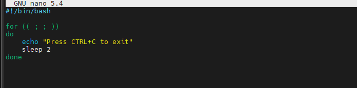

Запустил скрипт `#bash infinite1.sh` и проверил утилитой **htop** в другом
терминале.

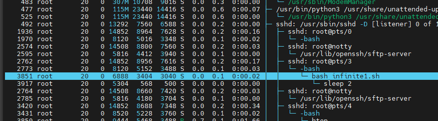

Попытался убить процесс `Kill- F9`. Как результат процесс перешел в состояние `terminated`.

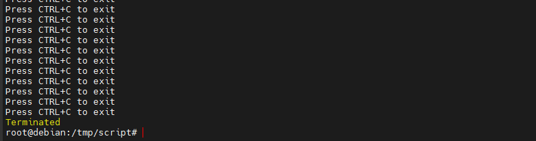

Лучший подход - перенаправить команду на `/dev/null`, это файл виртуального устройства, который при записи в него всё отправляет в пустоту.

```bash
bash infinite1.sh & \> /dev/null & - запустить процесс
kill -9 (PID процесса) - убить процесс
```

Второй вариант - команда **nohup**, сокращение от no hang up, это команда, которая поддерживает выполнение процесса даже после выхода из оболочки.

Он делает это, блокируя получение процессами сигнала SIGHUP (Signal Hang
UP), который является сигналом, который обычно отправляется процессу,
когда он выходит из терминала.

```bash
$ nohup infinite1.sh &\>/dev/null &
```
Сделал 3 скрипта одинаковых:

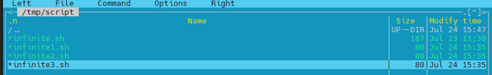

Запустил их в background

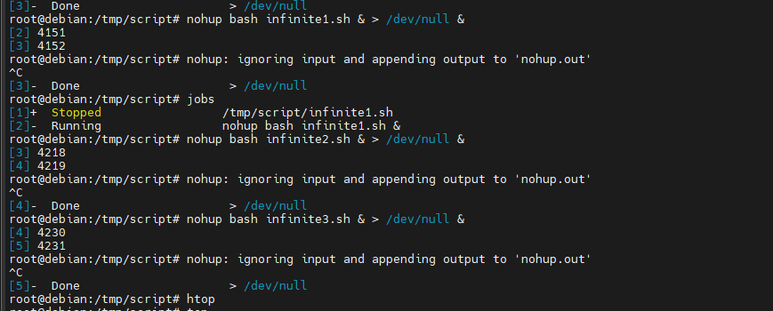

Вот что показывает **htop** - все три скрипта запущены, но в состоянии sleep. На значениях CPU - периодически появляются значения 0.5-0.7

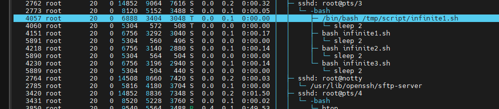

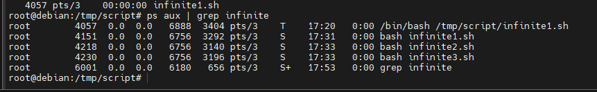

Ок. Поменял скрипты, чтобы соответствовали максимальному потреблению CPU. Пробую еще раз запустить.

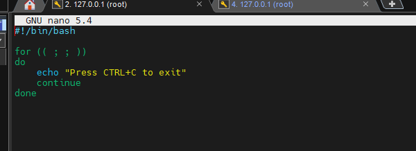

Теперь все три в состоянии - **running**

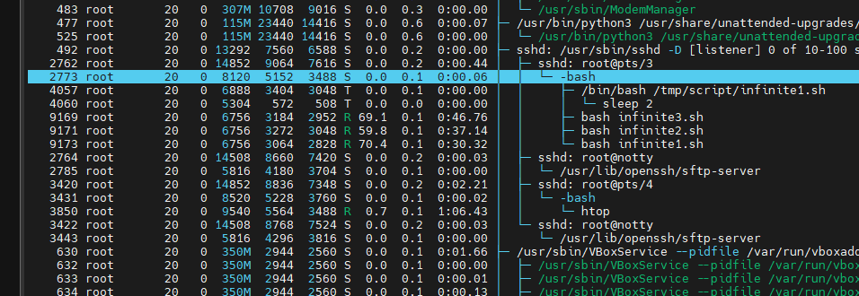

Запущен еще один скрипт с установленным более низким приоритетом.

```java
# nice -n 10 nohup bash infinite4.sh & \> /dev/null
```

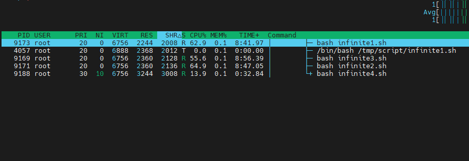

Меняем приоритет уже запущенного процесса

```java
#renice -n 5 -p 9169
```

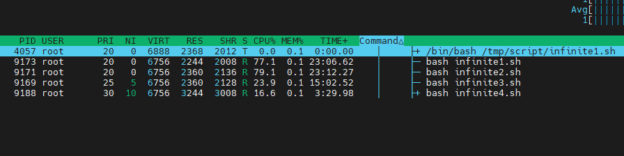

Также, команда renice позволяет суперпользователю изменять значение nice процессов любого пользователя, в моем случае я могу изменить для root

```java
#renice -n 15 -u root
```
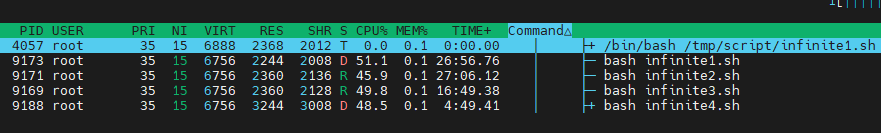

```java
#kill -9 9173 9171 9169 9188
```

Некоторые процессы могут рассматриваться как критически важные, в то время как другие могут быть выполнены за счет остатка ресурсов. Задачи с высоким приоритетом имеют низшее значение **nice**, так как они поглощают ресурсы. С другой стороны, задачи с низким приоритетом имеют высокое значение **nice**, так как они используют минимальное количество ресурсов.
