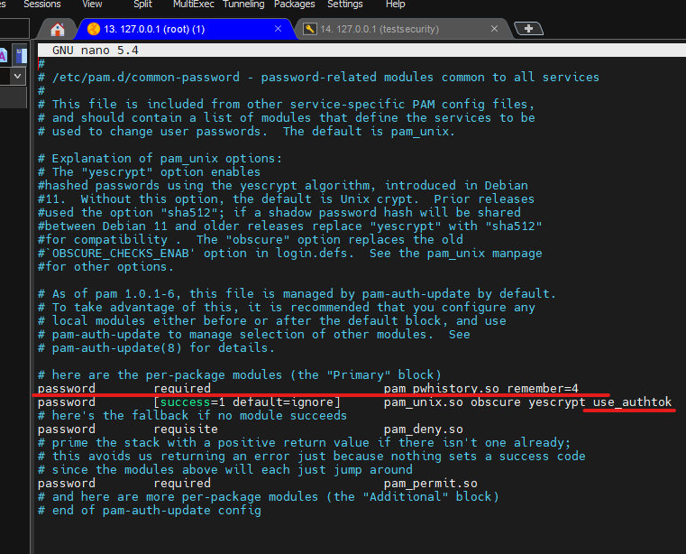
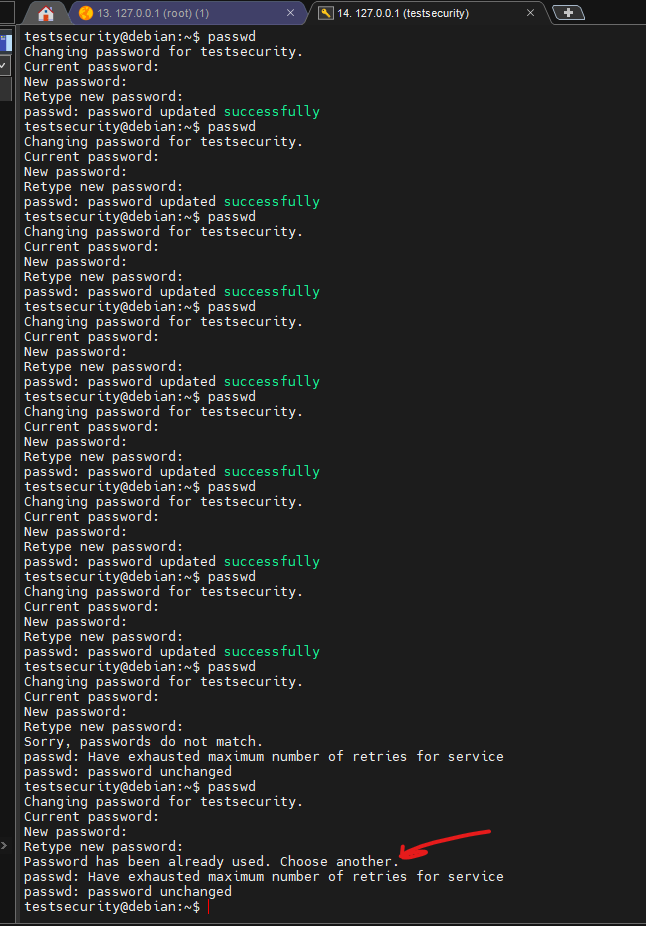
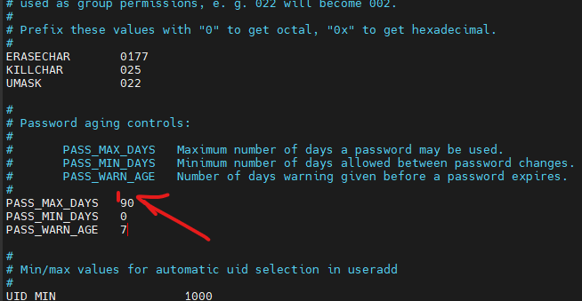
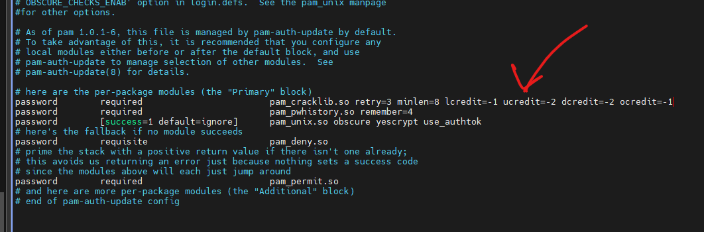
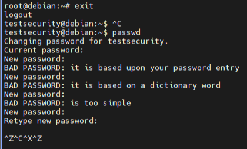
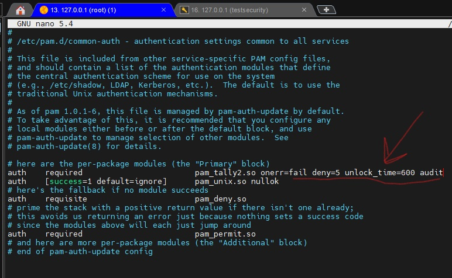
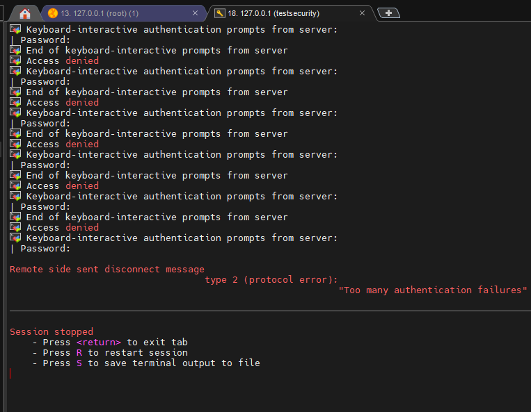
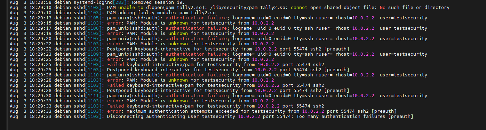

 
####**Preparing**
+ Добавляем отдельного юзера для экспериментов.
```bash
# adduser testsecurity

```
+ Запускаем нового юзера в группу sudo:

```bash
# usermod -aG sudo testsecurity
```
+ Проверяем: 

```bash
# grep testsecurity /etc/passwd
# id testsecurity 
# grep testsecurity /etc/group
```
+ Включить sudo для учетной записи пользователя в Debian. Можно добавить новому юзеру определенные привелегии root.

```bash
# grep testsecurity /etc/passwd
# id testsecurity 
# grep testsecurity /etc/group
# nano /etc/sudoers
```
>Первый параметр указывает на имя пользователя — в данном случае пользователь root.
Первый «ALL» указывает, что правило применимо ко всем хостам.
Второй «ВСЕ» указывает, что пользователь root может выполнять все команды как все пользователи.
Третий «ВСЕ» показывает, что пользователь root может выполнять все команды как все группы пользователей.
Наконец, последнее «ВСЕ» указывает на то, что правила применимы ко всем командам.

#### 1. Предотвращение использования или повторного использования одних и тех же старых паролей.

+ Чтобы решить эту задачу буду работать с модулем PAM pam_unix. Найдем где он лежит у нас в системе:

```bash
# find / -iname "pam_unix.so"
```
+ Ограничиваем повторное использование пароля в Linux в файлике:

```bash
# /etc/pam.d/common-password 
```




Все следующие пароли которые будут заданы пользователем будут работать по этой инструкции, их хэш используемых паролей для каждого юзера будет храниться в файле  `/etc/security/opasswd` , если его нет, то нужно его создать.

+ Убедиться что он доступен для чтения и записи только root:

```bash
# chmod 600 /etc/security/opasswd 
```

Дальше я поменял 5 паролей тестовым юзером и пытаясь изменить на тот который я использовал, обнаружил что уже не могу.



#### 2. Включение устаревания пароля.

+ Можно изменить в файлике  

```bash
# nano /etc/login.defs
```

>PASS_MAX_DAYS : максимальное количество дней, в течение которых можно использовать пароль. Если пароль старше этого значения, смена пароля будет принудительной.
PASS_MIN_DAYS : Минимальное количество дней между сменами пароля. Любые попытки изменить пароль раньше, чем это, будут отклонены.
PASS_WARN_AGE : Количество дней предупреждения до истечения срока действия пароля. Ноль означает, что предупреждение выдается только в день истечения срока действия, отрицательное значение означает, что предупреждение не выдается. Если не указано, предупреждения не будет.



- [x] Как я понял изменения вступят в силу для всех следующих пользователей.
Есть также команда `# chage testsecurity` где с помощью ключей можно менять необходимые параметры.

#### 3. Добавление модуля libpam и реквизитов на пароль.

+ Установил модуль который  будет проверять пароли пользователей по словарным словам, чтобы предотвратить использование слабых паролей. 

```bash
# apt-get install libpam-cracklib
```
+ Открываем конфиг файл: 

```bash
# nano /etc/pam.d/common-password
```



> minlen – Минимальная длина пароля. (По умолчанию 9)
lcredit — Максимальное количество кредитов за использование символов нижнего регистра (если параметр > 0), или минимальное требуемое число символов нижнего регистра (если параметр < 0). По умолчанию 1.
ucredit – Максимальное количество кредитов за использование символов верхнего регистра (если параметр > 0), или минимальное требуемое число символов верхнего регистра (если параметр < 0). По умолчанию 1.
dcredit — Максимальное количество кредитов за использование цифр (если параметр > 0), или минимальное требуемое число цифр (если параметр < 0). По умолчанию 1.
ocredit — Максимальное количество кредитов за использование иных символов (если параметр > 0), или минимальное требуемое количество иных символов (если параметр < 0). По умолчанию 1.
retry - сколько раз пользователь может повторить попытку.



- [x] Работает. Попробовал с трех попыток ввести. И не получилось, так как retry=3.

Можно еще  бло выполнить задачу с помощью модуля pam_pwquality 

```bash
# nano /etc/security/pwquality.conf
```

#### 4. Блокировка акк на время после 5 неудачных попыток логина.

+ Заходим и правим конфиг файл:

```bash
# nano /etc/pam.d/common-auth
```


> Получается что при некорректном вводе пароля на 6 раз, акк будет уходить в блок на 10 минут и все это будет писатся в логи. Также можно поставить политику и для рута.

+ Смотрим лог при необходимости, рестарт сервиса. И пробуем залогинится по ssh.

```bash
# systemctl restart sshd
# tail /var/log/auth.log
```





***Полезные ссылки для меня:***
https://www.linuxfordevices.com/tutorials/linux/linux-password-policies
https://www.cyberciti.biz/tips/linux-set-default-password-expiry-for-all-new-users.html
https://habr.com/ru/company/otus/blog/448996/
https://upcloud.com/resources/tutorials/manage-linux-user-account-security
https://www.cyberciti.biz/tips/how-to-linux-prevent-the-reuse-of-old-passwords.html
https://www.tecmint.com/lock-user-accounts-after-failed-login-attempts-in-linux/