  
  
[](https://github.com/ellerbrock/open-source-badges/)  

###Configure Software RAID on Linux
В самом начале стоит провести подготовку и добавить в SATA контролер на VirtualBox дополнительный виртуальный диск для Proxmox ёмкостью на 50ГБ. Проверить можно командой `#lsblk`

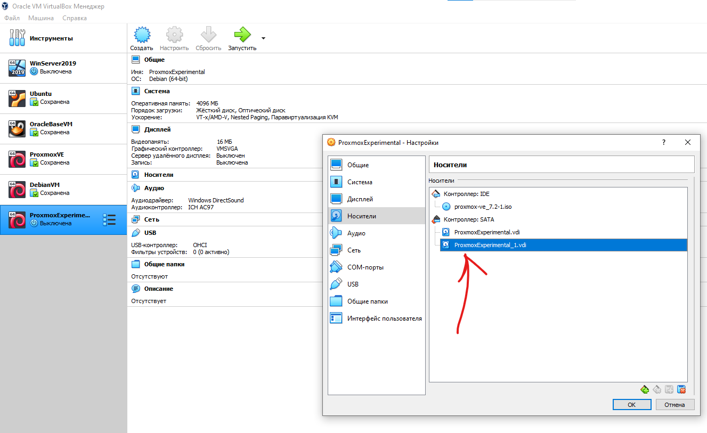

После этого зашел в терминал Proxmox выполнил команду `# fdisk /dev/sdb`, создаем партишн `n`, не указываем значения секторов, пусть будут дефолтные и сохраняем `w`. Создаем физический том **LVM Volume** командой `# pvcreate /dev/sdb1` и создаем группу томов `# vgcreate newdrive /dev/sdb1`. Чтобы добавить LVM в Proxmox, переходим **Datacenter** –> **Storage** –> **add** –> **LVM**.

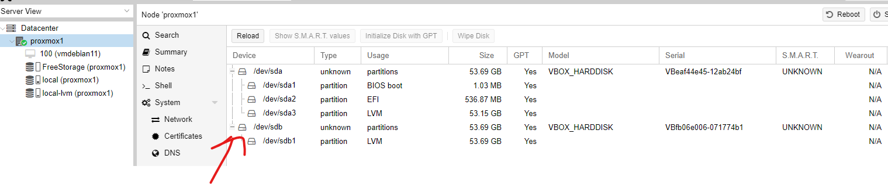
___

Планирую создать RAID 1, который также известен как зеркалирование дисков. RAID 1 создает идентичные копии данных. Если у вас есть два жестких диска в RAID 1, то данные будут записываться на оба диска. На двух жестких дисках одинаковые данные.
 На диске **sda** установлен мой дистрибутив Linux, нужно добавить два отдельных диска к виртуалке **sdb** и **sdc**. Подключил их через интерфейс **SCASI** Proxmox.

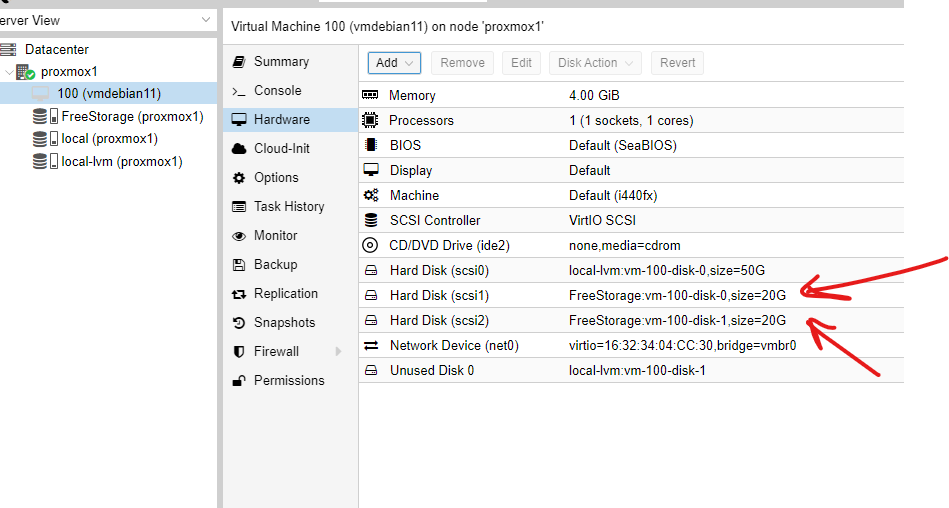

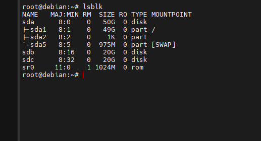

+ Устанавливаю пакеткоторый используется для создания, управления и мониторинга устройств Linux Software MD (RAID).

```c
# apt-get update && apt-get install mdadm
```

+ Делаем диски доступными для создания RAID.

```c
# fdisk /dev/sdb
# fdisk /dev/sdc
# fdisk -l /dev/sdc /dev/sdd
```
>Если разделы больше 2ТБ, то нужно использовать `parted` и размечать под GPT

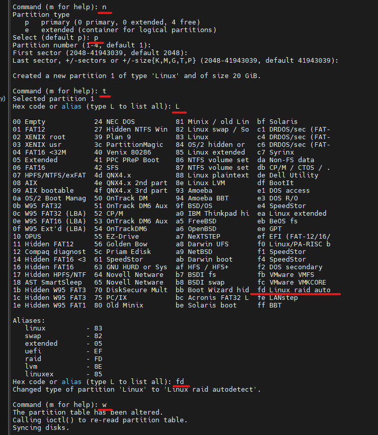

В итоге получаем два диска и на каждом по одному разделу на весь диск.

+ Собираем RAID массив.

```c
# mdadm --create --verbose /dev/md2 --level=1 --raid-devices=2 /dev/sdc1 /dev/sdd1
```
+ После того как система соберет массив, начнется процесс ресинхронизации.

```c
# nano /proc/mdstat
```
```shell
Personalities : [raid1]
md2 : active raid1 sdc1[1] sdb1[0]
      20953088 blocks super 1.2 [2/2] [UU]

unused devices: <none>
```

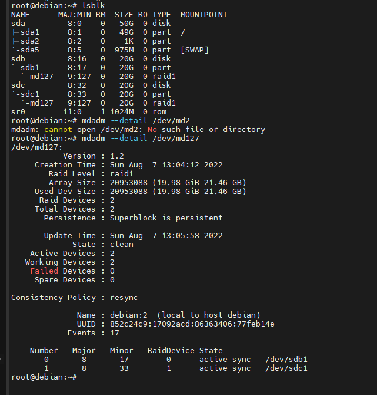

Для того чтобы создать логический том LVM над RAID, я решил добавить еще один RAID1 из двух партишн по 20ГБ итого у меня вышло:

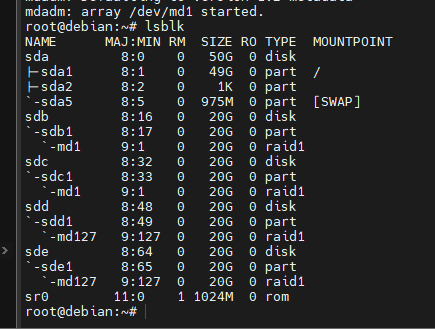

> LVM (Logical Volume Manager) – подсистема операционных систем Linux, позволяющая использовать разные области физического жесткого диска или разных жестких дисков как один логический том. LVM встроена в ядро Linux и реализуется на базе device mapper. 

 + Дальше установил набор утилит из пакета **lvm2** для работы с логическими томами.

```c
# apt-get install lvm2
```

+ Решил разбить свои два зеркальных RAID1 на 2 раздела размеченных под LVM (Не стоит не забыть про "change a partition's system id" **t**, выбираем LVM **8e**)

```c
# fdisk /dev/md1
# fdisk /dev/md127
```

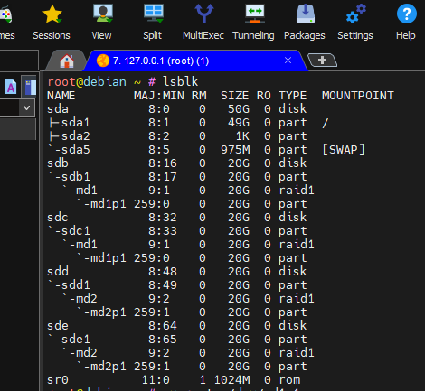

+ Первым делом мы подготавливаем физические тома с помощью **pvcreate**. PV может быть размещён как на целом диске, так и на отдельном его разделе. 

```c
# pvcreate /dev/md1p1
# pvcreate /dev/md2p1
# pvdisplay -C
```

+ Потом добавляем их в группу. Можно сказать формируем общий пул из памяти блочных устройств. 

```c
# vgcreate vg_critical /dev/md1p1 /dev/md2p1
# vgdisplay -C
```

+ Теперь из этого общего пула формируем два виртуальных раздела 20ГБ и 19.96ГБ под разные нужды.

```c
# lvcreate -n lv_for_files -L 20G vg_critical
# lvcreate -n lv_for_photos -L 19.96G vg_critical
# lvdisplay -C
```

+ Созданные логические тома появляются как блочные устройства в **/dev/mapper/**:

```c
# ls -l /dev/mapper
```
+ Cоздадим файловую систему на разделах

```c
# mkfs.ext4 /dev/vg_critical/lv_for_photos
# mkfs.ext4 /dev/vg_critical/lv_for_files
```
+ Монтируем разделы руками.

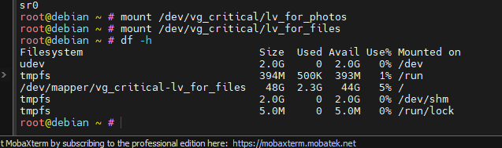

+ Чтобы установить и проверить квоты, нам сначала нужно установить инструменты командной строки для квот, используя apt.

```c
# apt-get install quota
```


+ Чтобы не монтировать каждый раз руками наш раздел, добавим запись о нем в fstab.
Сначала получим UUID раздела и добавим строки следующего формата в /etc/fstab.
Проверим конфигурацию fstab и примонтируем все разделы указанные в нем.

```c
# lsblk -o NAME,UUID
# mount -a
```

+ Чтобы активировать квоты в определенной файловой системе, нам нужно смонтировать ее с указанием нескольких параметров, связанных с квотами. Мы делаем это, обновляя запись файловой системы в файле конфигурации /etc/fstab.

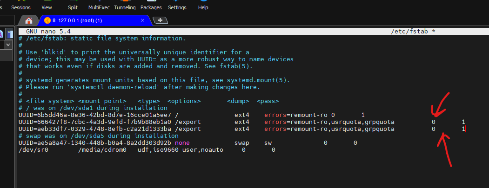

Или так

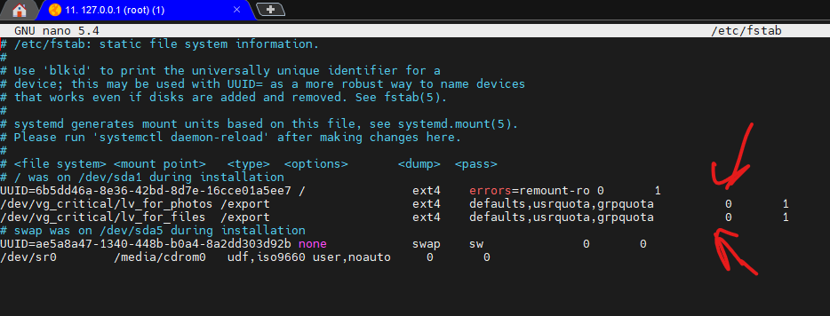

```c
# mount -o remount /export
```
+ Проверяем.

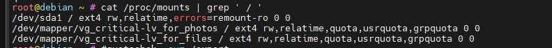

```c
# cat /proc/mounts | grep ' / '
```

Чтобы автоматически устанавливать квоту для новых пользователей, нужно настроить шаблонного пользователя (с помощью `edquota` или `setquota`) и указать его имя пользователя в переменной **QUOTAUSER** в файле `/etc/adduser.conf`. Эта настройка квоты будет автоматически применяться ко всем новым пользователям, созданным с помощью команды **adduser**.

### Итог

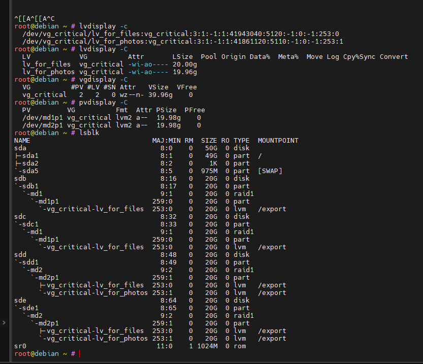


***Полезные ссылки для меня:***

1. http://l.github.io/debian-handbook/html/ru-RU/sect.quotas.html
2. http://l.github.io/debian-handbook/html/ru-RU/advanced-administration.html#sect.raid-soft
3. https://www.digitalocean.com/community/tutorials/how-to-set-filesystem-quotas-on-debian-9
4. https://habr.com/ru/post/111503/
5. https://www.tune-it.ru/web/sky/blog/-/blogs/4393667
6. https://4te.me/post/software-raid1-ubuntu/
7. https://habr.com/ru/post/255427/
8. https://github.com/uglide/azure-content/blob/master/articles/virtual-machines/virtual-machines-linux-configure-raid.md#create-the-disk-partitions
