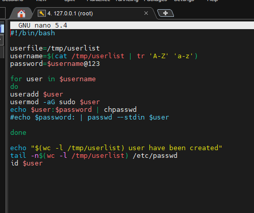
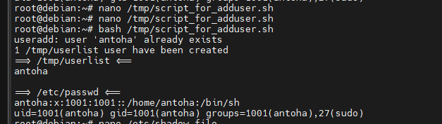
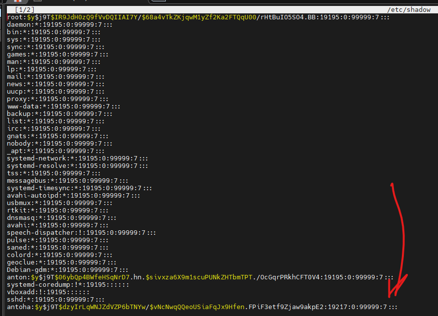

### ***Shell script to add user and password in Linux with root privileges***
___

Для скрипта оттдельно создается файл <span style="color:blue">userfile.</span> где лежат имена юзеров. Скрипт хватает имя юзера с файла и потом к этому именни добавляет `@123` заходит в цикл, там присваивается новая переменная `user`, после этого выполняюся команды. Команда `echo` выводит даные с переменных на стандртный `output`. Данные выхода с конвеера забирает команда `chpasswd` и обновляет пароли. Когда цикл завершится, отработает следущая команда которая покажет количество строк добавленных в файл `userlist` и потом выведет строки с нашим юзером из `userlist` в `passwd`. Закоменченая строчка работает в Linux Red Hat.



```shell
#!/bin/bash

userfile=/tmp/userlist
username=$(cat /tmp/userlist | tr 'A-Z' 'a-z')
password=$username@123

for user in $username
do
useradd $user (тут можно использовать adduser)
usermod -aG sudo $user
echo $user:$password | chpasswd
#echo $password: | passwd --stdin $user

done

echo "$(wc -l /tmp/userlist) user have been created"
tail -n$(wc -l /tmp/userlist) /etc/passwd
id $user
```



Проверка:

```shell
# nano /etc/shadow file
# nano /etc/passwd
```



___

### ***Shell script for work with user directory***

___

```shell
#!/bin/bash

if [ "$whoami" == "antoha2" ]; then
       echo "Script must be run as user: antoha2"
       exit 255
fi

   mkdir "$HOME/task"

   groupname=$(cat /etc/group | cut -d ':' -f 1)

for group in $groupname
do

   mkdir $HOME/task/$group && chmod 607 $(find $HOME/task/$group -type d) && chgrp sudo $(find $HOME/task/$group -type d);
   chown antoha $(find $HOME/task/$group -type d)
   #-exec chmod 607 {} + -type d -exec chgrp -R antoha2 root {}

done

   ls -la $HOME/task | grep "^d"


if [ -d "$HOME/task" ]
then

   echo "Directory exists"
   chmod g+s $HOME/task
   chmod 1770 $HOME/task
   touch  $HOME/task/test && ln -s $HOME/task/test $HOME/task/link_on_test && ln $HOME/task/test $HOME/task/link_on_test1

else

   echo "Error: directory does not exists."

fi

   touch $HOME/task/file-{1..10}.txt && tar -cvzf archive_with_files.tar.gz $(find $HOME/task -type f -name '*.txt')
```

Сначала создал такой скрипт который полностью отрабатывал как нужно. Его можно запускать от обычного **user** и все будет хорошо, кроме команд `chgrp` и `chown` они будут менять только владельца и группу файлов пользоваля в группе которого я состою и кроме **root**. 

Вот так все заработало:

```shell
#!/bin/bash

if [ "$whoami" == "root" ]; then
       echo "Script must be run as user: root"
       exit 255
fi

   mkdir "/home/antoha2/task"

   groupname=$(cat /etc/group | cut -d ':' -f 1)

for group in $groupname
do

   mkdir /home/antoha2/task/$group && chmod 607 $(find /home/antoha2/task/$group -type d) && chgrp root $(find /home/antoha2/task/$group -type d);
   chown root $(find /home/antoha2/task/$group -type d)
   #-exec chmod 607 {} + -type d -exec chgrp -R antoha2 root {}

done

   ls -la /home/antoha2/task | grep "^d"


if [ -d "/home/antoha2/task" ]
then

   echo "Directory exists"
   chmod g+s /home/antoha2/task
   chmod 1770 /home/antoha2/task
   touch  /home/antoha2/task/test && ln -s /home/antoha2/task/test /home/antoha2/task/link_on_test && ln /home/antoha2/task/test /home/antoha2/task/link_on_test1

else

   echo "Error: directory does not exists."

fi

   touch /home/antoha2/task/file-{1..10}.txt && tar -cvzf /home/antoha2/task/archive_with_files.tar.gz $(find /home/antoha2/task -type f -name '*.txt')
```
___

#### ***Результат - вывод файловой системы командой `tree`***

___

Тут есть папки с именами групп с файла `/etc/group`, две линки софт и хард на файл `test` и так же заархивированный и сжатый архив, который внутри содержит 10 файлов `file1...file10.txt`

```sh
root@debian:/#  tree -C -a -f -pug /home/antoha2/task
/home/antoha2/task
├── [drw----rwx root     root    ]  /home/antoha2/task/adm
├── [drw----rwx root     root    ]  /home/antoha2/task/antoha
├── [drw----rwx root     root    ]  /home/antoha2/task/antoha2
├── [drw----rwx root     root    ]  /home/antoha2/task/anton
├── [-rw-r--r-- root     root    ]  /home/antoha2/task/archive_with_files.tar.gz
├── [drw----rwx root     root    ]  /home/antoha2/task/audio
├── [drw----rwx root     root    ]  /home/antoha2/task/avahi
├── [drw----rwx root     root    ]  /home/antoha2/task/avahi-autoipd
├── [drw----rwx root     root    ]  /home/antoha2/task/backup
├── [drw----rwx root     root    ]  /home/antoha2/task/bin
├── [drw----rwx root     root    ]  /home/antoha2/task/bluetooth
├── [drw----rwx root     root    ]  /home/antoha2/task/cdrom
├── [drw----rwx root     root    ]  /home/antoha2/task/colord
├── [drw----rwx root     root    ]  /home/antoha2/task/crontab
├── [drw----rwx root     root    ]  /home/antoha2/task/daemon
├── [drw----rwx root     root    ]  /home/antoha2/task/Debian-gdm
├── [drw----rwx root     root    ]  /home/antoha2/task/dialout
├── [drw----rwx root     root    ]  /home/antoha2/task/dip
├── [drw----rwx root     root    ]  /home/antoha2/task/disk
├── [drw----rwx root     root    ]  /home/antoha2/task/fax
├── [-rw-r--r-- root     root    ]  /home/antoha2/task/file-10.txt
├── [-rw-r--r-- root     root    ]  /home/antoha2/task/file-1.txt
├── [-rw-r--r-- root     root    ]  /home/antoha2/task/file-2.txt
├── [-rw-r--r-- root     root    ]  /home/antoha2/task/file-3.txt
├── [-rw-r--r-- root     root    ]  /home/antoha2/task/file-4.txt
├── [-rw-r--r-- root     root    ]  /home/antoha2/task/file-5.txt
├── [-rw-r--r-- root     root    ]  /home/antoha2/task/file-6.txt
├── [-rw-r--r-- root     root    ]  /home/antoha2/task/file-7.txt
├── [-rw-r--r-- root     root    ]  /home/antoha2/task/file-8.txt
├── [-rw-r--r-- root     root    ]  /home/antoha2/task/file-9.txt
├── [drw----rwx root     root    ]  /home/antoha2/task/floppy
├── [drw----rwx root     root    ]  /home/antoha2/task/games
├── [drw----rwx root     root    ]  /home/antoha2/task/geoclue
├── [drw----rwx root     root    ]  /home/antoha2/task/gnats
├── [drw----rwx root     root    ]  /home/antoha2/task/input
├── [drw----rwx root     root    ]  /home/antoha2/task/irc
├── [drw----rwx root     root    ]  /home/antoha2/task/kmem
├── [drw----rwx root     root    ]  /home/antoha2/task/kvm
├── [lrwxrwxrwx root     root    ]  /home/antoha2/task/link_on_test -> /home/antoha2/task/test
├── [-rw-r--r-- root     root    ]  /home/antoha2/task/link_on_test1
├── [drw----rwx root     root    ]  /home/antoha2/task/list
├── [drw----rwx root     root    ]  /home/antoha2/task/lp
├── [drw----rwx root     root    ]  /home/antoha2/task/lpadmin
├── [drw----rwx root     root    ]  /home/antoha2/task/mail
├── [drw----rwx root     root    ]  /home/antoha2/task/man
├── [drw----rwx root     root    ]  /home/antoha2/task/messagebus
├── [drw----rwx root     root    ]  /home/antoha2/task/netdev
├── [drw----rwx root     root    ]  /home/antoha2/task/news
├── [drw----rwx root     root    ]  /home/antoha2/task/nogroup
├── [drw----rwx root     root    ]  /home/antoha2/task/operator
├── [drw----rwx root     root    ]  /home/antoha2/task/plugdev
├── [drw----rwx root     root    ]  /home/antoha2/task/proxy
├── [drw----rwx root     root    ]  /home/antoha2/task/pulse
├── [drw----rwx root     root    ]  /home/antoha2/task/pulse-access
├── [drw----rwx root     root    ]  /home/antoha2/task/render
├── [drw----rwx root     root    ]  /home/antoha2/task/root
├── [drw----rwx root     root    ]  /home/antoha2/task/rtkit
├── [drw----rwx root     root    ]  /home/antoha2/task/saned
├── [drw----rwx root     root    ]  /home/antoha2/task/sasl
├── [drw----rwx root     root    ]  /home/antoha2/task/scanner
├── [drw----rwx root     root    ]  /home/antoha2/task/shadow
├── [drw----rwx root     root    ]  /home/antoha2/task/src
├── [drw----rwx root     root    ]  /home/antoha2/task/ssh
├── [drw----rwx root     root    ]  /home/antoha2/task/ssl-cert
├── [drw----rwx root     root    ]  /home/antoha2/task/staff
├── [drw----rwx root     root    ]  /home/antoha2/task/sudo
├── [drw----rwx root     root    ]  /home/antoha2/task/sys
├── [drw----rwx root     root    ]  /home/antoha2/task/systemd-coredump
├── [drw----rwx root     root    ]  /home/antoha2/task/systemd-journal
├── [drw----rwx root     root    ]  /home/antoha2/task/systemd-network
├── [drw----rwx root     root    ]  /home/antoha2/task/systemd-resolve
├── [drw----rwx root     root    ]  /home/antoha2/task/systemd-timesync
├── [drw----rwx root     root    ]  /home/antoha2/task/tape
├── [-rw-r--r-- root     root    ]  /home/antoha2/task/test
├── [drw----rwx root     root    ]  /home/antoha2/task/tss
├── [drw----rwx root     root    ]  /home/antoha2/task/tty
├── [drw----rwx root     root    ]  /home/antoha2/task/users
├── [drw----rwx root     root    ]  /home/antoha2/task/utmp
├── [drw----rwx root     root    ]  /home/antoha2/task/uucp
├── [drw----rwx root     root    ]  /home/antoha2/task/vboxsf
├── [drw----rwx root     root    ]  /home/antoha2/task/video
├── [drw----rwx root     root    ]  /home/antoha2/task/voice
└── [drw----rwx root     root    ]  /home/antoha2/task/www-data
```

___

#### ***Результат - вывод файловой системы командой ``tree`` папки `/home/antoha`***

___

```bash
root@debian:/#  tree -C -a -f -pug /home/antoha2
/home/antoha2
├── [-rw-r--r-- antoha2  antoha2 ]  /home/antoha2/.bash_logout
├── [-rw-r--r-- antoha2  antoha2 ]  /home/antoha2/.bashrc
├── [drwx------ antoha2  antoha2 ]  /home/antoha2/.cache
│   └── [drwx------ antoha2  antoha2 ]  /home/antoha2/.cache/mc
│       └── [-rw-r--r-- antoha2  antoha2 ]  /home/antoha2/.cache/mc/Tree
├── [drwx------ antoha2  antoha2 ]  /home/antoha2/.config
│   └── [drwx------ antoha2  antoha2 ]  /home/antoha2/.config/mc
│       ├── [-rw-r--r-- antoha2  antoha2 ]  /home/antoha2/.config/mc/ini
│       └── [-rw-r--r-- antoha2  antoha2 ]  /home/antoha2/.config/mc/panels.ini
├── [drwx------ antoha2  antoha2 ]  /home/antoha2/.local
│   └── [drwx------ antoha2  antoha2 ]  /home/antoha2/.local/share
│       └── [drwx------ antoha2  antoha2 ]  /home/antoha2/.local/share/mc
│           └── [-rw------- antoha2  antoha2 ]  /home/antoha2/.local/share/mc/history
├── [-rw-r--r-- antoha2  antoha2 ]  /home/antoha2/.profile
├── [-rwxr-xr-x root     root    ]  /home/antoha2/script_for_manage_userdir.sh
└── [drwxrws--T root     root    ]  /home/antoha2/task
```

Тут видно что на директорию `/home/antoha2/task` установлен бит `s` **SGID**, это значит, что все файлы созданные в этом каталоге будут наследовать ту же группу что и каталог. Так эе установлен бит `T`- **Sticky Bit**, это что пользователи не смогут удалять или переименовывать файл внутри каталога до тех пор, пока они не станут владельцем этого каталога.

***Полезные ссылки для меня:***

1. https://www.cyberciti.biz/faq/linux-show-directory-structure-command-line/

2. https://kb.iu.edu/d/acfi

3. https://ngelinux.com/sticky-bit-suid-sgid-bit-in-linux/

4. https://explainshell.com