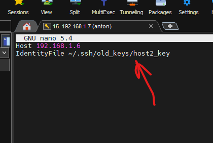
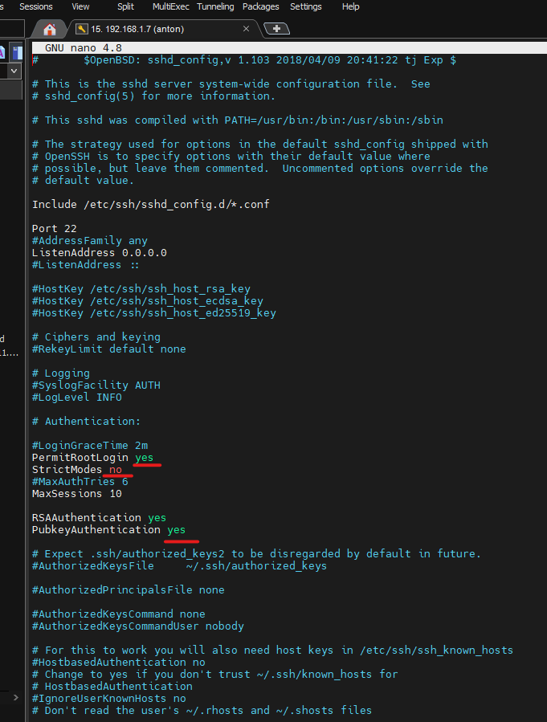
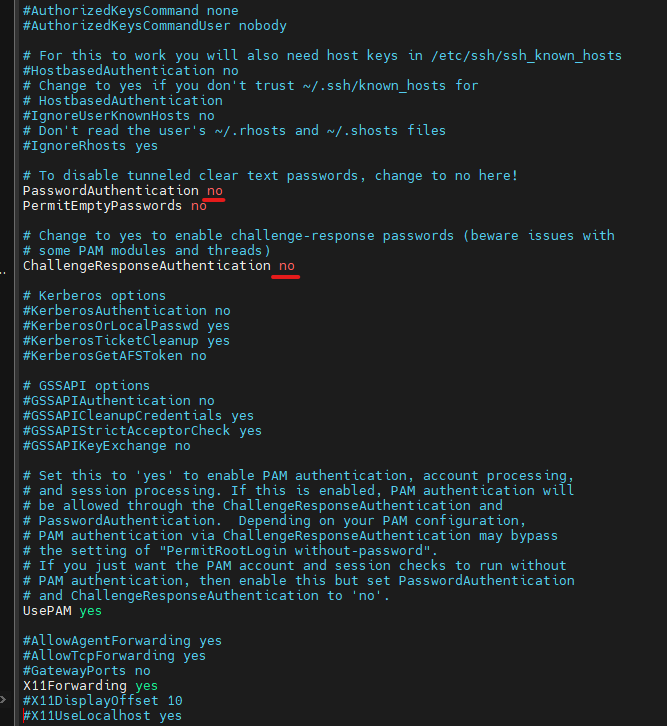
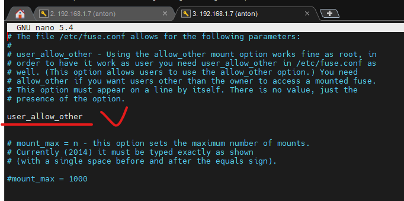
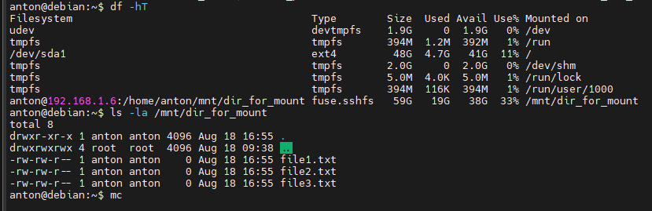

### ***<mark style="background-color: #00BFFF">Generate an SSH Key Pair and Upload Your Public Key</mark>***

У меня есть две виртуалки: одна -Ubuntu на сетевом мосте, вторая Debian на NAT. Устанавливаю соединение SSH с DEBIAN на UBUNTU. Первое что делаю это генерирую пару ключей с помощью утилиты **keygen**, с метедом шифрования **RSA**

```shell
$ ssh-keygen -b 2048 -t rsa
```

Проверяем:

```shell
$ ls -la ~/.ssh
```
``` shell
total 20
drwx------  2 anton anton 4096 Aug 17 08:46 .
drwxr-xr-x 16 anton anton 4096 Aug 17 08:45 ..
-rw-------  1 anton anton 1823 Aug 17 08:46 id_rsa
-rw-r--r--  1 anton anton  394 Aug 17 08:46 id_rsa.pub
-rw-r--r--  1 anton anton  222 Jul 22 13:14 known_hosts
```

Для начала можно просто соединится с удаленным хостом для проверки.

``` shell
$ ssh -p 22 anton@192.168.1.6
```

ssh-copy-id  это утилита, доступная в некоторых операционных системах, которая может копировать открытый ключ SSH на удаленный сервер через SSH:


``` shell
$ ssh-copy-id -p 22 anton@192.168.1.6
```

``` shell
/usr/bin/ssh-copy-id: INFO: Source of key(s) to be installed: "/home/anton/.ssh/id_rsa.pub"
/usr/bin/ssh-copy-id: INFO: attempting to log in with the new key(s), to filter out any that are already installed
/usr/bin/ssh-copy-id: INFO: 1 key(s) remain to be installed -- if you are prompted now it is to install the new keys
Password:

Number of key(s) added: 1

Now try logging into the machine, with:   "ssh -p '22' 'anton@192.168.1.6'"
and check to make sure that only the key(s) you wanted were added.
```

***<mark style="background-color: #FF00FF">Второй способ скопировать ключи, через утилиту scp</mark>***

+ Подключится к серверу по его IP-адресу через SSH с пользователем, которому я хочу добавить ключ:

``` shell
$ ssh anton@192.168.1.6
```

+ Создать каталог `~/.ssh` и файл `authorized_keys`, если они еще не существуют.

``` shell
$ mkdir -p ~/.ssh && touch ~/.ssh/authorized_keys
```

+ Предоставить каталогу `~/.ssh` и файлам `authorized_keys` соответствующие права доступа:

``` shell
$ chmod 700 ~/.ssh && chmod 600 ~/.ssh/authorized_keys
```

+ В другом терминале на моем локальном компьютере использовать scp, чтобы скопировать содержимое открытого ключа SSH (id_rsa.pub) в файл author_keys на моем удаленном сервере.

``` shell
$ scp ~/.ssh/id_rsa.pub -p 22 anton@127.0.0.1:~/.ssh/authorized_keys
```

___

<span style="color:red;font-weight:700">Конечно же у меня с первого раза не получилось установить соединение по `RSAkey`, ключи не могли друг друга найти, а по паролю все получалось. Я уже даже попробывал с другой виртулалки сделать (IP 192.168.1.7). Потом нашел статью и там было сказано что в конфигурации клиента, SSH получает данные из разных источников в своей очередности (сначала он видит файл конфигурации клиента пользователя `~/.ssh/config`, а уже потом общесистемный файл конфигурации клиента `/etc/ssh/ssh_config`) я создал файл `config` вот по этой инструкции https://kb.iu.edu/d/aews и аунтификация по ключам прошла успешно.  </span>

``` shell
anton@debian:~/.ssh/old_keys$ ssh anton@192.168.1.6
Welcome to Ubuntu 20.04.4 LTS (GNU/Linux 5.13.0-52-generic x86_64)

 * Documentation:  https://help.ubuntu.com
 * Management:     https://landscape.canonical.com
 * Support:        https://ubuntu.com/advantage

4 обновления может быть применено немедленно.
Чтобы просмотреть дополнительные обновления выполните: apt list --upgradable


The list of available updates is more than a week old.
To check for new updates run: sudo apt update
New release '22.04.1 LTS' available.
Run 'do-release-upgrade' to upgrade to it.

Your Hardware Enablement Stack (HWE) is supported until April 2025.
Last login: Wed Aug 17 23:13:50 2022 from 192.168.1.7
```

Файл находится по пути `~/.ssh/config` и указывает на закрытый ключ по пути `~/.ssh/old_keys/host2_key` права `chmod 700` выдал файлам.




```shell
$ nano /ect/ssh/sshd_config
```





___

### ***<mark style="background-color: #00BFFF">Use SSHFS to Mount Remote File Systems Over SSH</mark>***

+ установил из пакетов клиент SSHFS (Secure Shell FileSystem) на свою локальную машину.

```shell 
$ apt update
$ apt-get install sshfs
```

+ Создал точку монтирования на своей локальной машине по пути `/mnt/dir_for_mount`, а на удаленном - `/home/anton/mnt/dir_for_mount`. Владельцем папок должен быть юзер через котрого происходит логин через SSH. 

+ Так же, отключал выполнение команды через `sudo`, тем что добавил пользователя в группу `fuse`:

```shell

$ sudo groupadd fuse
$ sudo usermod -a -G fuse anton
```

При попытке смонтировать, выдало такое предупреждение:

```shell
fusermount3: option allow_other only allowed if 'user_allow_other' is set in /etc/fuse.conf
```

Редактировал файл:

```shell
$ nano /etc/fuse.conf
```



+ Смоунтил удаленную файловую систему. Второй вариант команды, задает приватный ключик.

```shell
$ sshfs -o allow_other,default_permissions anton@192.168.1.6:/home/anton/mnt/dir_for_mount /mnt/dir_for_mount

$ sshfs -o allow_other,IdentityFile=~/.ssh/old_keys/host2_key anton@192.168.1.6:/home/anton/mnt/dir_for_mount /mnt/dir_for_mount
```

+ Чек ап, создал три файлика .txt на удаленном хосте и проверил.




___

***<mark style="background-color: #00BFFF">Полезные ссылки для меня:</mark>***

1. https://www.tecmint.com/sshfs-mount-remote-linux-filesystem-directory-using-ssh/

2. https://linuxize.com/post/using-the-ssh-config-file/

3. https://kb.iu.edu/d/aews

4. https://www.digitalocean.com/community/tutorials/how-to-use-ssh-to-connect-to-a-remote-server

5. https://www.linode.com/docs/guides/use-public-key-authentication-with-ssh/

6. https://www.digitalocean.com/community/tutorials/how-to-use-sshfs-to-mount-remote-file-systems-over-ssh