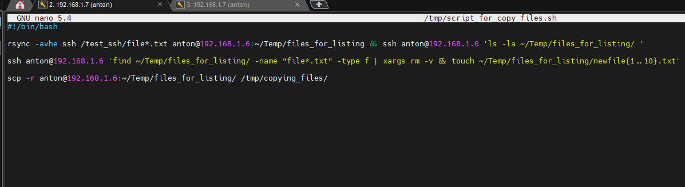
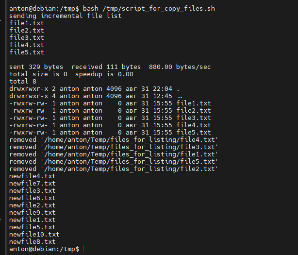
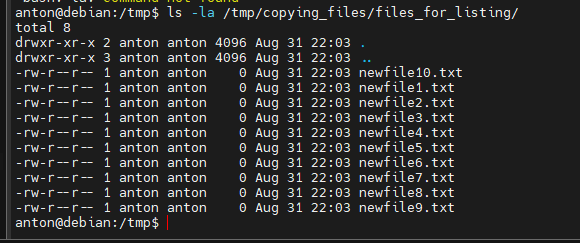

### ***Script use with ssh***
___
*Этот скрипт использует для копирования и синхронизации файлов с локального на удаленный хост команду `rsync`. На обеих машинах должен быть установлен. Использовал флаги `-avhe`, Значит скопировать все, все файлы. Получить больше информации во время передачи. Вывести числа в более удобном для человека формате используя крупные единицы измерения. Последней опцией выбираем для связи `ssh`. И `/test_ssh/file*.tx` тут у меня уже біли созданы файлы на локальном хосте, а это `~/Temp/files_for_listing` путь удаленного хоста куда эти файлы скопируем. Потом `ls -la` делает листинг и показывает нам файлы переданные как подтверждение. Дальше `find ~/Temp/files_for_listing/` находит все соответсвующие файлы в этом каталоге и вывод передается команде `xargs` которая удаляет каждый файл и опция `-v` для вывода информации. Следующая команда создает в этой же директории новых 10 файлов и с помощью `scp` я копирую с удаленного хоста в локальный все 10 файлов рекурсивно вместе с папкой в которой они лежат.*

***Итого получился такой скрипт***



```bash
#!/bin/bash

rsync -avhe ssh /test_ssh/file*.txt anton@192.168.1.6:~/Temp/files_for_listing && ssh anton@192.168.1.6 'ls -la ~/Temp/files_for_listing/ '

ssh anton@192.168.1.6 'find ~/Temp/files_for_listing/ -name "file*.txt" -type f | xargs rm -v && touch ~/Temp/files_for_listing/newfile{1..10}.txt'

scp -r anton@192.168.1.6:~/Temp/files_for_listing/ /tmp/copying_files/
```
***С таким выводом***



***Это директория куда в конечном итоге скопировались файлы***



___

#### ***Полезные ссылки для меня:***

+ *https://www.cyberciti.biz/faq/linux-unix-how-to-find-and-remove-files/*

+ *https://betterprogramming.pub/how-to-use-the-linux-xargs-command-to-create-powerful-pipelines-a5d5d7067703*

+ *https://www.digitalocean.com/community/tutorials/how-to-use-rsync-to-sync-local-and-remote-directories*