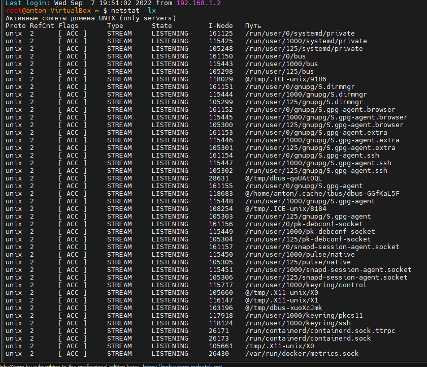
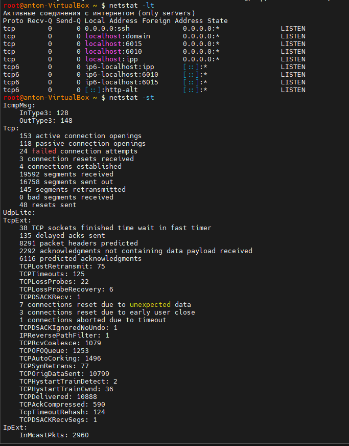
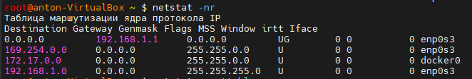
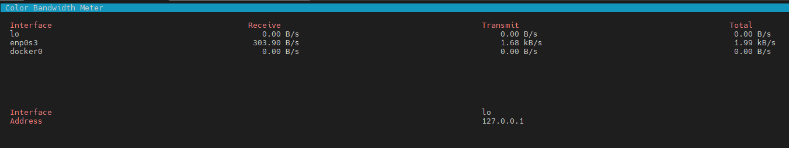
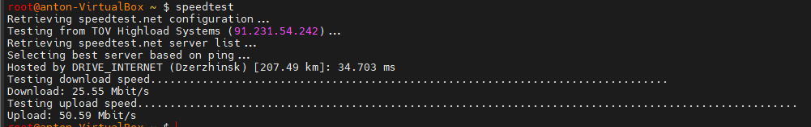
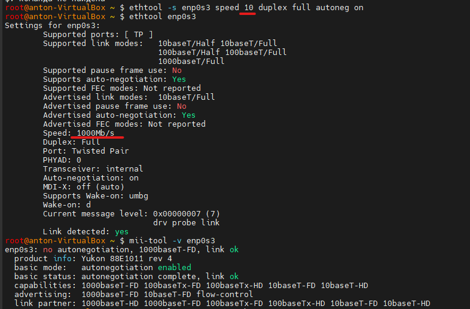
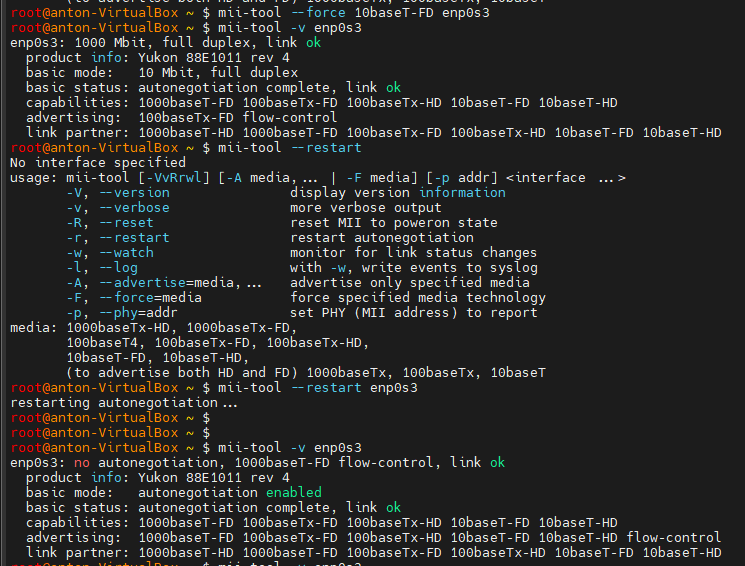

### ***Monitoring tool for connections***

___

+ ***Проверить юникс сокеты и их состояние с помощью утилиты `netstat`.***

*Сокеты домена Unix, которые используют локальные файлы для отправки и получения данных вместо сетевых интерфейсов и IP-пакетов.*

```shell
$ netstat -lx
```




*Сокет - это абстракция сетевого взаимодействия в операционной системе Linux. Каждому сокету соответствует пара IP-адрес + номер порта. Сокеты — это способ обеспечения взаимодействия между процессами между программами, работающими на сервере, или между программами, работающими на разных серверах. Связь между серверами зависит от сетевых сокетов, которые используют Интернет-протокол (IP) для инкапсуляции и обработки отправки и получения данных.*

+ ***Проверить TCP сокеты и их состояние с помощью утилиты `netstat`.***

```shell
$ netstat -lt
$ netstat -st
```




*Потоковые сокеты ориентированы на соединение, что означает, что пакеты, отправленные и полученные из сетевого сокета, доставляются операционной системой хоста для обработки приложением. Сетевые потоковые сокеты обычно используют протокол управления передачей (TCP) для инкапсуляции и передачи данных через сетевой интерфейс. Пакеты TCP могут поступать на физический сетевой интерфейс в любом порядке. В случае, если пакеты поступают не по порядку, сетевой адаптер и операционная система хоста обеспечат их повторную сборку в правильной последовательности для обработки приложением.*

*Вывод, у меня все сокеты находятся в состоянии ***LISTEN*** и ***LISTENING*** а это значит что они прослушивают все входящие соединения,*

***FIN_WAIT*** *Сокет ожидает закрытия, чтобы обработать пакеты, все еще находящиеся в сети.*

***FIN_WAIT1*** *Сокет ожидает закрытия, чтобы обработать пакеты, все еще находящиеся в сети.*

***FIN_WAIT2*** *Сокет закрывается, и соединение разрывается.*


+ ***Проверить таблицу маршрутизации с помощью утилиты `netstat`.***

```diff 
$ netstat -nr

+ -r показать цифровые адреса вместо символических;
+ -n показать таблицу роутинга;
```



___

+ ***Проверить скорость передачи и определить режим дуплекс/полудуплекс утилитой `mii-tool` и `ethtool`.***


 ****mii-tool*** - В инструкции написано, что утилита предназначена для просмотра и управления статусом сетевых интерфейсов. Данная утилита в принципе должна использоваться сетевым адаптером для автоопределения скорости и режима дуплекса.*


 ****Полудуплекс*** означает, что каждое устройство может отправлять или получать данные одновременно. ***Полный дуплекс*** означает, что оба устройства могут одновременно отправлять и получать данные.*

```shell
$ mii-tool -v enpOs3

$ ethtool enp0s3
```


*Оба измерения показывают работу сетевой карты в полном дуплексном режиме.*


+ ***Проверить скорость передачи по сети, измення режимы сетевой карты дуплекс.полудуплекс и скорость передачи дуплекс/полудуплекс утилитой `speedtest-cli` и `cbm`.***

  + *установить необходимые утилиты*

  ```shell
  $ apt-get install speedtest-cli
  $ apt-get install cbm
   ```

   + *В дефолтоном состоянии карты у меня дуплекс 1000МБ, я перехожу в дупелкс 10МБ следующей командой:*

   ```shell
   $ mii-tool -F 10baseT-FD enp0s3

   $ ethtool –s enp0s3 speed 10 duplex full autoneg on
   ```
   + *И используем две команды для теста сети*

   ```shell
   $ speedtest

   $ cbm
   ```





*Так как у меня домашний хост на Windows, делал на виртуалке Linux Ubuntu и поменять дуплекс не получилось.*

*Там есть возможность полезть в конфиг сетки и поменять вручную чтобы после перезагрузки системы изменения сохранялись. `vi /etc/sysconfig/network-scripts/ifcfg-enp0s3`*

```shell
ETHTOOL_OPTS="speed 1000 duplex full autoneg on"
```

***Virtual network cards have no "speed". The physical network speed is dictated by the physical connections on the host.***







___

#### ***Полезные ссылки для меня:***


+ https://robotmoon.com/bash-prompt-generator/

+ http://linux-ip.net/html/tools-mii-tool.html

+ https://phoenixnap.com/kb/linux-network-speed-test

+ https://www.computerhope.com/unix/unetstat.htm

+ https://habr.com/ru/company/otus/blog/539550/

+ https://www.tecmint.com/20-netstat-commands-for-linux-network-management/

+ https://www.digitalocean.com/community/tutorials/understanding-sockets

+ https://www.digitalocean.com/community/tutorials/how-to-use-top-netstat-du-other-tools-to-monitor-server-resources