## ***Set up OpenVPN Server***

___

*Виртуальная частная сеть (VPN) предоставляет возможность контакта для двух локальных сетей через интернет, используя туннель. Туннель обычно зашифрован для конфиденциальности. VPN сети часто используются для интеграции удалённой машины в локальную сеть компании.*

*OpenVPN — это полнофункциональная SSL VPN (виртуальная частная сеть). Он реализует безопасное сетевое расширение уровня 2 или 3 OSI с использованием протокола SSL/TLS.*

*В моей задаче, будет ***одна*** ВМ в облаке ***AWS***, на ней собственно и будет ВПН сервер. А ***вторая*** ВМ - будет клиентом. Находится ВМ на локальной машине.*

___

+ *Для начала выполнил регистрацию на облачной платформе AWS и создал из бесплатных самую обыкновенную ВМ с операционной системой Ubuntu (1 ядро, 8гб пямяти, t2.micro)*


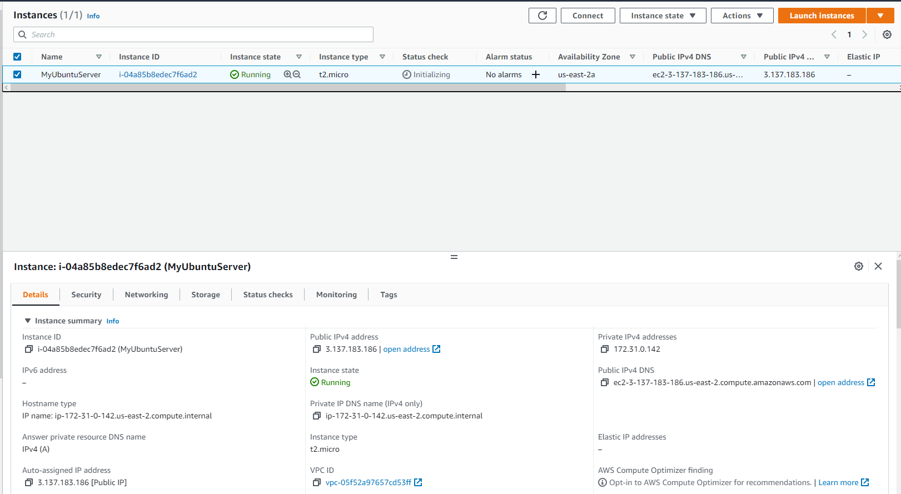

+ Подключился по ssh

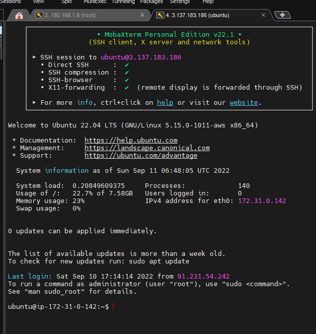

+ *Мой адресс публичный ***172.31.0.142*** Я заметил что по умолчанию с каждым инстансом связан частный IP-адрес и маршрутизируемый в Интернете публичный IP. Связь частного IP-адреса с сетевым интерфейсом сохраняется во время остановки и перезапуска инстанса. Связь прерывается после завершения работы инстанса. Публичный адрес связан с инстансом до тех пор, пока он не будет приостановлен, не прекратит работу или пока данный адрес не будет заменен эластичным IP-адресом.*

```shell
$ ip addr show eth0

$ dig TXT +short o-o.myaddr.l.google.com @ns1.google.com
```

+ *Устанановил OpenVPN на Ubuntu в AWS.*

```shell
$ wget https://git.io/vpn -O openvpn-install.sh
$ nano openvpn-install.sh
```

+ *Запуск `openvpn-install.sh` для установки сервера OpenVPN. Ключи и сертификаты будут хранится по этому пути  `/etc/openvpn/server/`*

```shell
$ sudo chmod +x openvpn-install.sh
$ sudo bash openvpn-install.sh
```

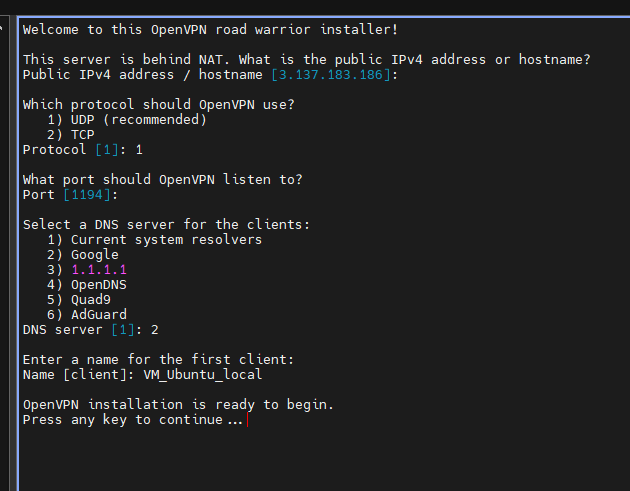

*После отработки скрипта добавились определенные правила для порта 1194 который наш сервис будет слушать в файле `/etc/systemd/system/openvpn-iptables.service` и сгенерировался файл конфигурации вашего сервера openvpn*

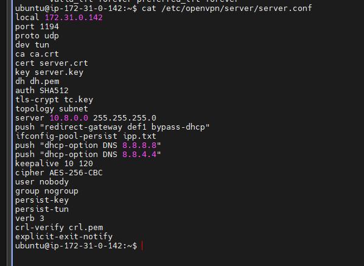

+ *Проверить активен ли сервис openvpn*

```shell
$ sudo systemctl status openvpn-server@server.service
```

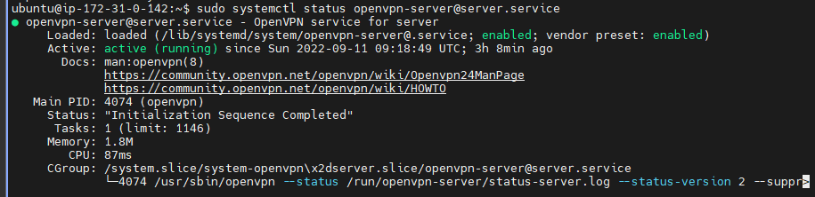

+ *Выполняю конфигурацию клиента, нужно файл `VM_Ubuntu_local.ovpn` скопировать и положить клиенту. У меня возникла проблема с ключами ssh, снова утилита ***scp*** не работала в обе стороны из-за недоступности публичного ключа. В общем сделал через ***FileZilla***, скопировал на ***Windows***, а оттуда положил на ВМ ***Ubuntu*** в папку `~/VPNkeys/VM_Ubuntu_local.ovpn`*

```shell
$ sudo find / -type f -name "*.ovpn"

$ scp -i /root/VPNkeys/KeyPair_VMonAWS.ppk ubuntu@3.137.183.186:~/VM_Ubuntu_local.ovpn .
```

+ *Установить на клиентской машине openvpn.*

```shell
$ sudo apt install openvpn
```


+ *Скопировал и переименовал. Проверил видимость файла. Получается что ситема Linux автоматически подключится при перезагрузке компьютера с помощью сценария `/etc/init.d/openvpn`*

```shell
$ cp ~/VPNkeys/VM_Ubuntu_local.ovpn /etc/openvpn/client.conf

$ openvpn --client --config /etc/openvpn/client.conf

$ sudo systemctl start openvpn@client
```

+ Так же нужно не забыть открыть порт для доступа из частной сети к VPN тунелю.


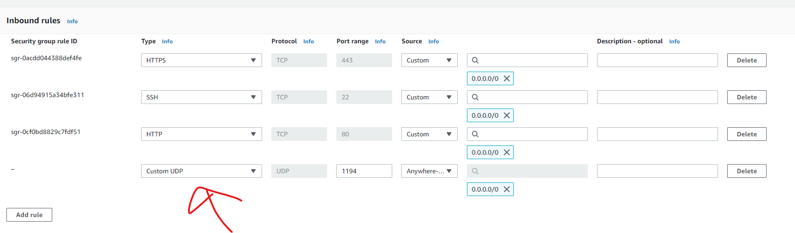

***При попытке подключения через консоль выдавало ошибку:***

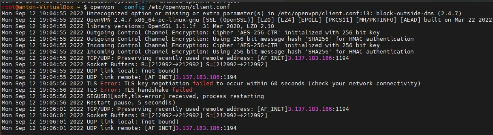

___

*В общем, я случайно перезапустил виртуалку и у меня изменился общедоступный айпи который я конфигурировал для впн клиента с ***3.137.183.186*** на ***3.128.203.137****

+ *Отозвать существующего пользователя и ремув настроек сервера*

```shell
$ sudo bash openvpn-install.sh
```

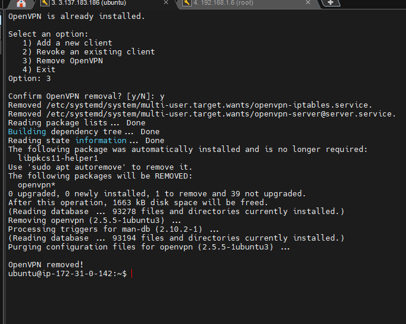


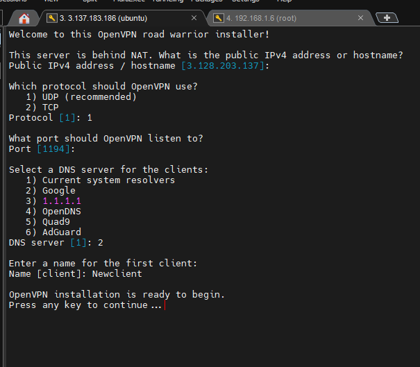

+ *Убеждаюсь, что демон OpenVPN прослушивает порт, который я указал по сценарию*

```shell
$ sudo ss -tupln | grep openvpn
```

+ *Убеждаюсь, что создан сетевой интерфейс `tun0` для впн тунеля. Директива server `10.8.0.0`  `255.255.255.0` определяет подсеть, которая будет использоваться для VPN; сервер использует первый IP адрес в этом диапазоне (`10.8.0.1`), а остальные адреса распределяются клиентам.*

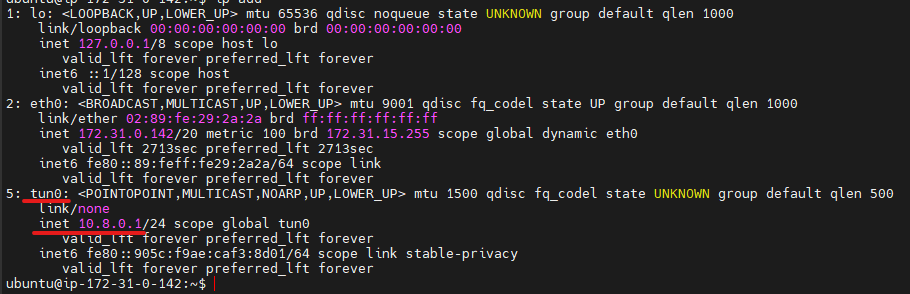

+ *Перекидываю файл кофигураций клиенту с помощью прошлых манипуляций. Через сетевые подключения из графического интерфейса загружаю файл `.ovpn` и активирую подулючение VPN, после этого сразу проверяю.*

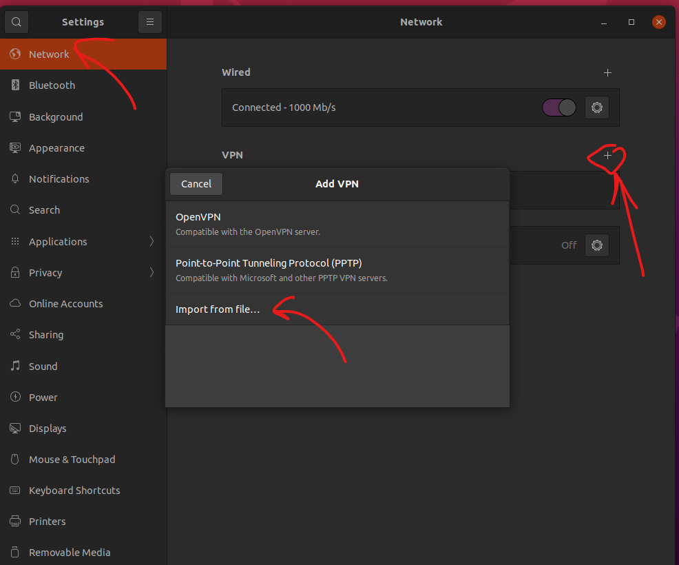

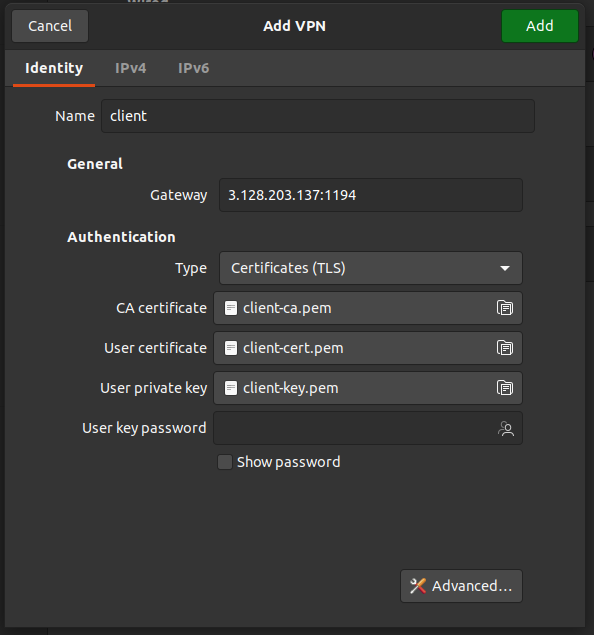


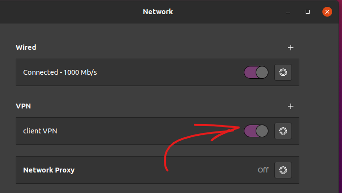

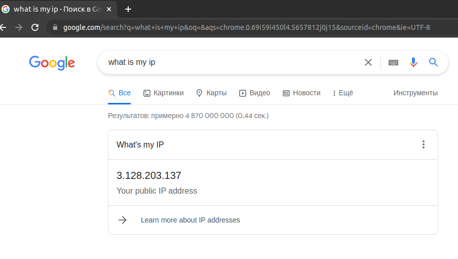

+ *Все! Выхожу в сеть уже под впн, так же проверяю могу ли я достучатся к машине во внутреней сети, к моей Ubuntu в облаке. И можно увидеть что на клиентской машине у меня стал активный интерфейс для впн соединения `tun0`.*

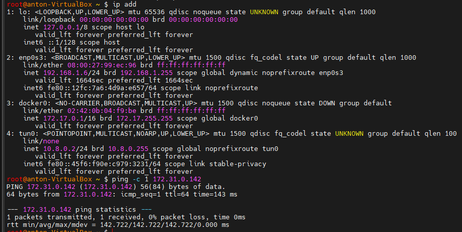


___

#### ***Полезные ссылки для меня:***

*1. https://www.tecmint.com/install-openvpn-in-ubuntu/*

*2. https://www.cyberciti.biz/faq/ubuntu-18-04-lts-set-up-openvpn-server-in-5-minutes/*

*3. https://www.cyberciti.biz/faq/howto-setup-openvpn-server-on-ubuntu-linux-14-04-or-16-04-lts/*

*4. https://www.digitalocean.com/community/tutorials/how-to-set-up-and-configure-an-openvpn-server-on-ubuntu-20-04-ru#*