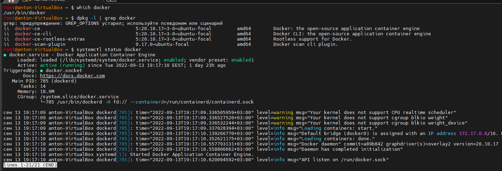
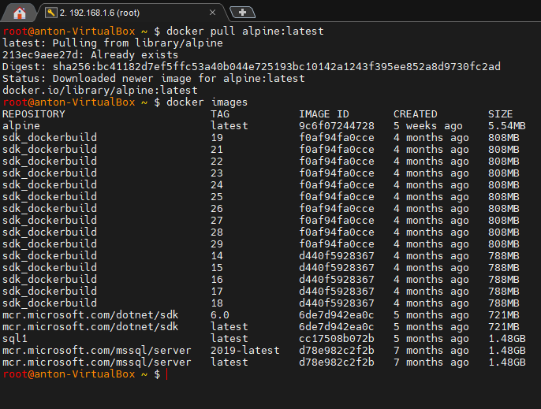
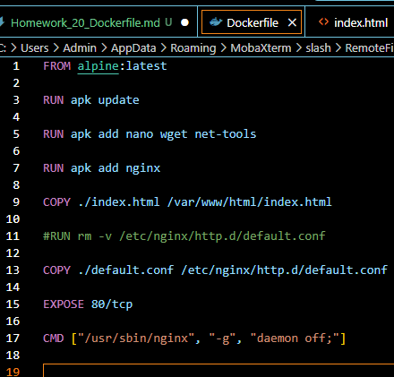
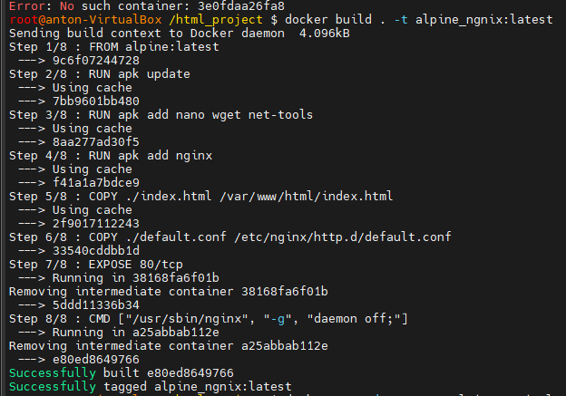
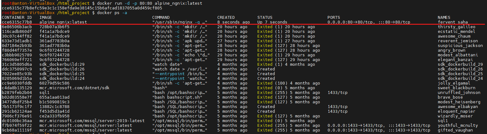
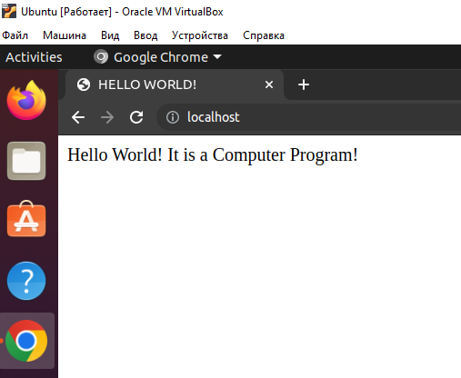
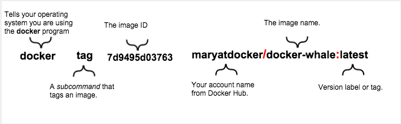
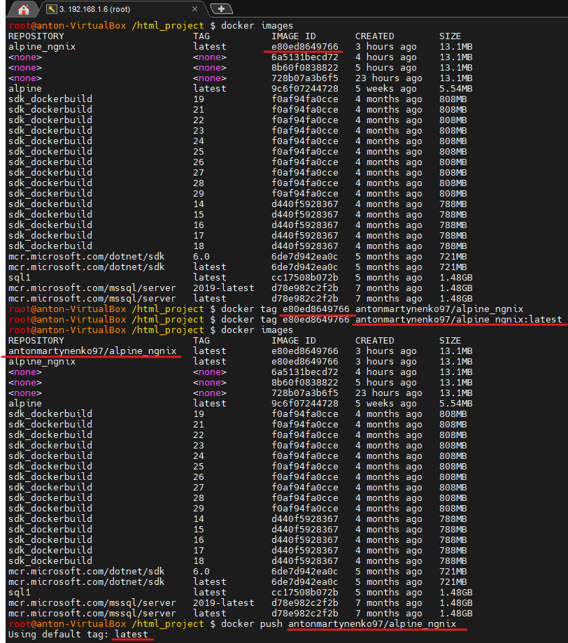
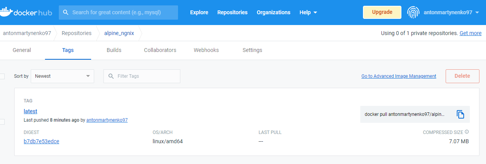

## ***Working with Docker Images and Containers. The dockerfile will install the nginx server into the container and copy the static html page.***

___

 
*`Docker` — это приложение, упрощающее процесс управления процессами приложений в контейнерах. Контейнеры позволяют запускать приложения в процессах, изолированных от ресурсов. Они похожи на виртуальные машины, но контейнеры более переносимы, более ресурсоемки*

*`Dockerfile` это текстовый документ, содержащий все команды, которые пользователь может вызвать в командной строке для сборки образа. Используя сборку докера, пользователи могут создать автоматизированную сборку, которая последовательно выполняет несколько инструкций командной строки.*


 *Веб-сервер `nginx` — это программное обеспечение, основная задача которого — обработка входящих и исходящих запросов на различных протоколах передачи данных. Рассмотрим этот процесс на примере веб-сайтов. После того как вы ввели URL-адрес сайта в адресной строке, браузер обращается к веб-серверу путём передачи запроса по протоколу HTTP. Веб-сервер выполняет некий набор инструкций, указанный в конфигах, и возвращает по HTTP ответ, например со статическими страницами сайта или данными для редиректа.*

*Фактический веб-контент, который по умолчанию состоит только из страницы Nginx по умолчанию, которую вы видели ранее, обслуживается из каталога `/var/www/html`. Это можно изменить, изменив файлы конфигурации `Nginx`.*
___

+ *1. Установка Docker теперь дает вам не только службу Docker (демон), но и утилиту командной строки docker или клиент Docker. У меня на Ubuntu, ***Docker*** был уже установлен из пакетов из официального репозитория такими командами:*

```shell
$ sudo apt update

$ sudo apt install apt-transport-https ca-certificates curl software-properties-common

$ curl -fsSL https://download.docker.com/linux/ubuntu/gpg | sudo apt-key add -

$ sudo add-apt-repository "deb [arch=amd64] https://download.docker.com/linux/ubuntu focal stable"

$ apt-cache policy docker-ce
```




+ *2. Стянул образ с докер регистра на базе alpine с тегом последней версии.*

```shell
$ docker pull alpine:latest

$ docker images
```



+ *3. Создаю папку `html_project` в которой у меня будет храниться статическая веб страница `index.html`, конфигурационный файл к ней `default.conf`, и докерфайл описывающий сборку образа `Dockerfile`*

```shell
$ mkdir /html_project

$ touch Dockerfile default.conf index.html
```

+ *4. Пишу Dockerfile в котором, мы начинаем создавать наш собственный образ, используя базовый образ `alpine`. В строке 1 мы делаем это с помощью команды `FROM`. Дальше в строках 3, 5, 6 я обновляю пакеты и устанавливаю необходимые утилиты и сам `nginx` сервер. Командой `COPY` я копирую свой индекс файл и ложу в дефолтную директорию в контейнере с которой уже работает `nginx`. После этого командой `COPY` прокидываем внутрь контейнера файлик для конфигурации дефолтного сайта и перезаписываем существующий, без него ничего не будет работать. Через `EXPOSE` открываю порт `80` чтобы он был доступен в Интернете. И `CMD` предоставляет значения по умолчанию для исполняемого контейнера, стартуем контейнер с отключеным демоном чтобы контейнер не остановился сразу после запуска*




*Файл `index.html`*

```html
<html>
<head>
    <title>HELLO WORLD!</title>
</head>
<body>
    <p>
       Hello World!
       It is a Computer Program!
    </p>
</body>
</html>
```

*Файл `defaul.conf`. `listen` - порт, на котором ваш сервер nginx будет прослушивать этот веб-сайт.`location` это каталог, в который я поместил файл .html моего веб-сайта (корневая папка на сервере будет рассматриваться как `/var/www/html`, и там вам будет предоставлен индексный файл с именем `index.html` или `index.htm`, можно добавить другие местоположения, чтобы указать на другие файлы на моем сервере, в данном случае это мой контейнер, просто добавив новые блоки местоположения). `index...` используется для указания файла, каталога `html`. И последнее `try_files` это как внутренее перенаправление и поиск файлов `$uri` проверяет как есть, а `uri/` проверяет URI как каталог, ищущий индексный файл.* 

```shell
server {
    listen 80;
    listen [::]:80;
    server_name localhost;
    
    location / {
        root /var/www/html;
        index index.html index.htm;
        try_files $uri $uri/ /index.html;
    }
}
```

*А по дефолту в образе `Alpine`, `default.conf` выглядит так:*

```shell
server {
        listen 80 default_server;
        listen [::]:80 default_server;

        # Everything is a 404
        location / {
                return 404;
        }

        # You may need this to prevent return 404 recursion.
        location = /404.html {
                internal;
        }
}
```

+ *5. В текущем каталоге с докерфайлом выполняю сборку образа с тегом. И проверка.*

```shell
$ docker build . -t alpine_ngnix:latest
$ docker images -l
```




+ *6. Запускаю контейнер с образа по тегу и проверяю.*

*`-d` = detached mode - Означает, что контейнер Docker работает в фоновом режиме вашего терминала. Если вы запускаете контейнеры в фоновом режиме*

*`-p` = port mapping - [имя хоста — вы] : [порт, который мы указали в `Dockerfile`, а также порт, на котором работает nginx]*

*`exec` позволяет зайти в контейнер и выполнять там команды*
```shell
$ docker run -d -p 80:80 alpine_ngnix:latest
$ docker ps -a
$ docker exec -it 3e0fdaa26fa8 sh
```


*Страница работает*




+ *7. Останавливаю контейнер и пушу готовый образ на DockerHub, после - удаляю образ локально. Для этого нужно залогинится с локальной машины на доккер регистр, потом протегировать образ локально чтобы он соответствовал имени пользователя и названию репозитория в DockerHub*

```shell
$ docker stop cce6315c77b8

$ docker login -u antonmartynenko97

$ docker images

$ docker tag e80ed8649766 antonmartynenko97/alpine_ngnix:latest

$ docker push antonmartynenko97/alpine_ngnix

$ docker rmi --force e80ed8649766
```







*8. Стянуть образ из регистра на локальную машину. Можно увидеть что подгрузился только последний слой.*

```shell

$ docker pull antonmartynenko97/alpine_ngnix:latest

$ docker images
```


___


#### ***Полезные ссылки для меня:***

*1. https://www.digitalocean.com/community/tutorials/how-to-install-and-use-docker-on-ubuntu-20-04#step-6-managing-docker-containers*

*2. https://www.digitalocean.com/community/tutorials/how-to-remove-docker-images-containers-and-volumes*

*3. https://www.digitalocean.com/community/tutorials/docker-explained-how-to-containerize-and-use-nginx-as-a-proxy*

*4. https://octopus.com/blog/using-nginx-docker-image*

*5. https://dev.to/vishwasnarayan5/static-website-on-docker-with-the-nginx-server-4aof*

*6. https://www.docker.com/blog/how-to-use-the-official-nginx-docker-image/*

*7. https://www.digitalocean.com/community/tutorials/how-to-run-nginx-in-a-docker-container-on-ubuntu-14-04*

*8. https://www.cjadkins.com/docker/2018/10/30/serving-a-static-web-page-docker.html*