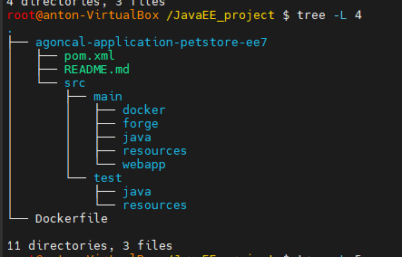
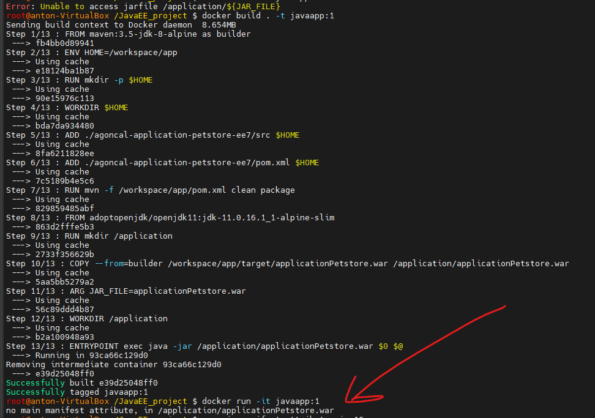

## ***A Guide to Docker Multi-Stage Builds for your java apps***

___


*С помощью `multi-stage builds` вы можете разделить процесс сборки на два (или более) отдельных образа:*

*`«build image»`, в который вы устанавливаете все пакеты и компиляторы и выполняете компиляцию (место на диске здесь не имеет значения)*
*`«run image»`, в который вы копируете только код своего приложения, а также другие (скомпилированные) библиотеки, которые вы копируете из образа сборки в образ запуска.*

*Этап сборки обычно включает в себя сборку приложения и упаковку сгенерированного артефакта в образ. Я использую `maven` в качестве инструмента сборки, что означает, что он будет загружать необходимые зависимости из репозиториев и сохранять их в образе.*

*`Maven` использует файл pom.xml уровня проекта для разрешения зависимостей проекта. Он загружает отсутствующие файлы `JAR` из частных и общедоступных репозиториев Maven и кэширует эти файлы для будущих сборок. Таким образом, в следующий раз, когда вы запустите свою сборку, она ничего не загрузит, если ваша зависимость не была изменена.*

*`Dependency` — это те библиотеки, которые непосредственно используются в вашем проекте для компиляции кода или его тестирования. Это концепция, в которой объекты получают другие требуемые объекты извне.*

*`Plagins` же используются самим Maven'ом при сборке проекта или для каких-то других целей (деплоймент, создание файлов проекта для Eclipse и др.).*


___

+ *1. Стянуть нужный образ уже с компилятором `jdk` и `maven` для создания артефактов на основе которого я буду строить свой образ `multi-stage`*

```shell
$ docker pull maven:3.5-jdk-8-alpine
```

+ *2. Создать папку на локальной машине и стянуть туда нужный репо с кодом который нужно будет собрать*

```shell
$ mkdir JavaEE_project
$ cd ./JavaEE_project
$ git clone https://github.com/agoncal/agoncal-application-petstore-ee7.git
```



+ *3. Стянуть базовый минимальный образ на базе которого будет выполнятся второй этап сборки с копированием артефакта `war`*

```sh
$ docker pull adoptopenjdk/openjdk11:jdk-11.0.16.1_1-alpine-slim
$ docker images
```

+ *4. Написать `Dockerfile` в котором: На первом этапе, который мы называем `builder`, мы собираем проект с помощью `Maven` и помещаем сборку в каталог с именем `/workspace/app`. На втором этапе сборки используется другой `image`, создается новая папка с именем /application и копируется результат сборки в эту папку. Ключевое отличие состоит в том, что команда COPY указывает дополнительный флаг `–from`, который сообщает Docker шаг, с которого следует скопировать артефакт. С помощью `mvn` происходит сборка с удалением целевого каталога и очистки проекта и с использованием юнит тестов. Инструкция `ENTRYPOINT` действует как исполняемый файл для нашего контейнера при запуске*

```sh
FROM maven:3.5-jdk-8-alpine as builder

ENV HOME=/workspace/app

RUN mkdir -p $HOME

WORKDIR $HOME

ADD ./agoncal-application-petstore-ee7/src $HOME

ADD ./agoncal-application-petstore-ee7/pom.xml $HOME

RUN mvn -f /workspace/app/pom.xml clean package


FROM adoptopenjdk/openjdk11:jdk-11.0.16.1_1-alpine-slim

RUN mkdir /application

COPY --from=builder /workspace/app/target/applicationPetstore.war /application/applicationPetstore.war

ARG JAR_FILE=applicationPetstore.war

WORKDIR /application

ENTRYPOINT exec java -jar /application/applicationPetstore.war $0 $@

#ENTRYPOINT ["java","-jar","/application/${JAR_FILE}"]
```


*exec `«$@»` обычно используется, чтобы сделать точку входа проходной, через которую затем выполняется команда docker. Он заменит текущую запущенную оболочку командой, на которую указывает `«$@»`. По умолчанию эта переменная указывает на аргументы командной строки. В нашем случае ей передается `java` `-jar` `/application/applicationPetstore.war`*

*5. Собрать имедж с докерфайла и запустить контейнер*

```shell
$ docker build . -t javaapp:1

$ docker run -it javaapp:1
```



*Выдает ошибку при запуске.*

___

#### ***Полезные ссылки для меня:***

*1. https://habr.com/ru/post/77382/*

*2. https://www.digitalocean.com/community/tutorials/maven-commands-options-cheat-sheet*

*3. https://blog.pavelsklenar.com/spring-boot-run-and-build-in-docker/*

*4. https://habr.com/ru/post/552494/*

*5. https://www.baeldung.com/ops/docker-cache-maven-dependencies*

*6. https://codefresh.io/blog/java_docker_pipeline/*

*7. https://spring.io/guides/topicals/spring-boot-docker/*

*8. https://www.javacodegeeks.com/2017/04/creating-smaller-java-image-using-docker-multi-stage-build.html*

*9. https://blog.bitsrc.io/a-guide-to-docker-multi-stage-builds-206e8f31aeb8*