## ***Load Balancer in AWS cloud. Working with web-servers and copy html.***

___


+ *Устанавливаю интерфейс командной строки в `AWS` на своей локальной машине*


```shell
$ curl "https://awscli.amazonaws.com/awscli-exe-linux-x86_64.zip" -o "awscliv2.zip"

$ unzip awscliv2.zip

$ sudo ./aws/install

$ aws --version
```

```shell
aws-cli/2.8.0 Python/3.9.11 Linux/5.15.0-46-generic exe/x86_64.ubuntu.20 prompt/off
```

+ *Потом необходимо создать учетные данные интерфейса командной строки AWS из консоли управления AWS. Переходим в `IAM - Dashboard - Users ` Там будут перечислены все доступные учетные записи пользователей в учетной записи AWS, у меня пусто - создаю и также сохдаю группу `testusers` и добавляю туда нового юзера. Можно авторизироватся по этой ссылке https://148658770076.signin.aws.amazon.com/console*


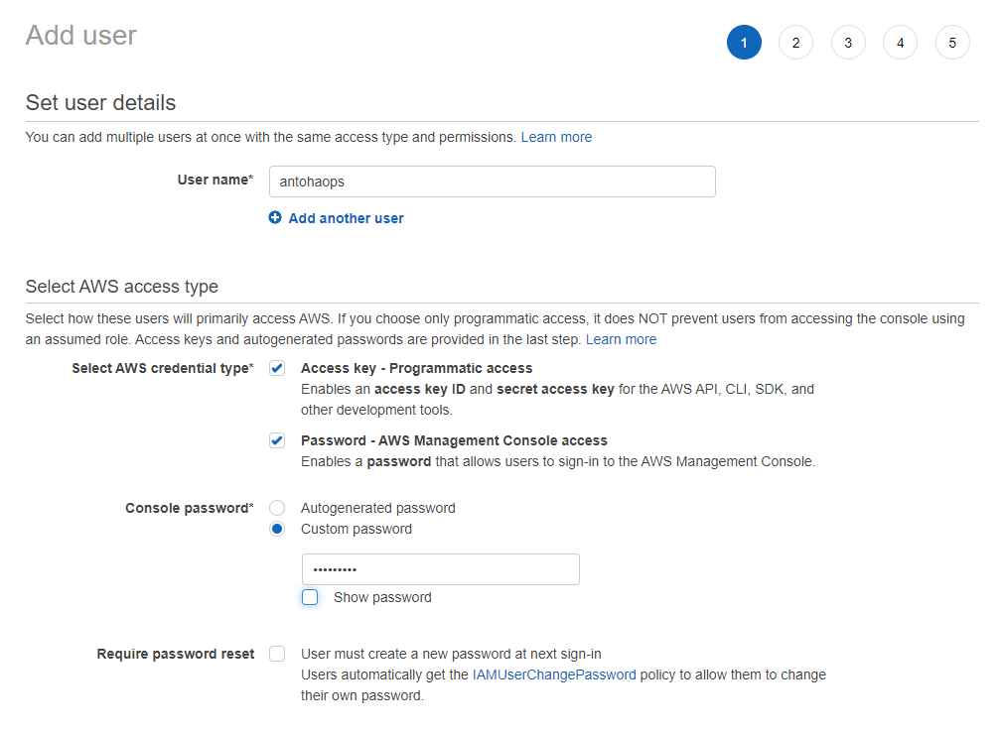

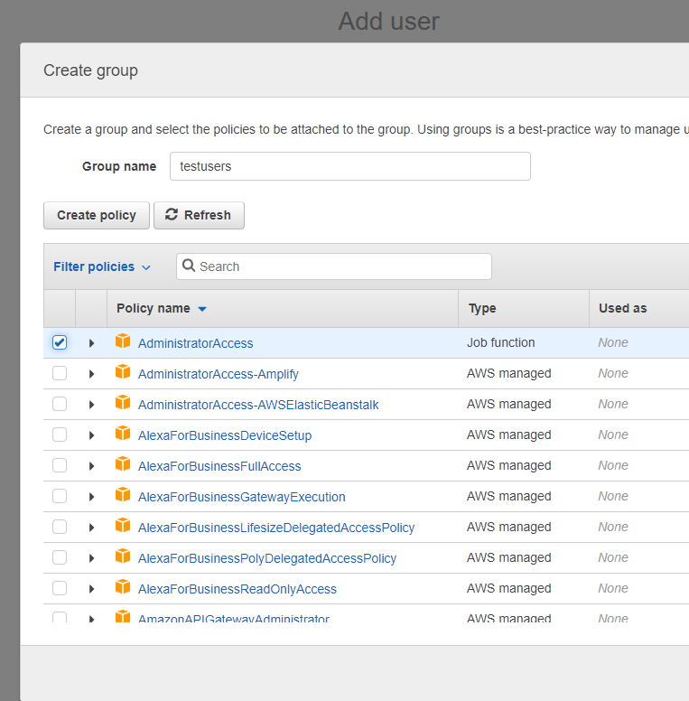

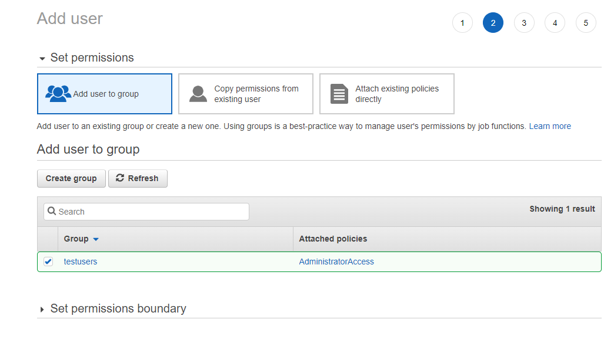

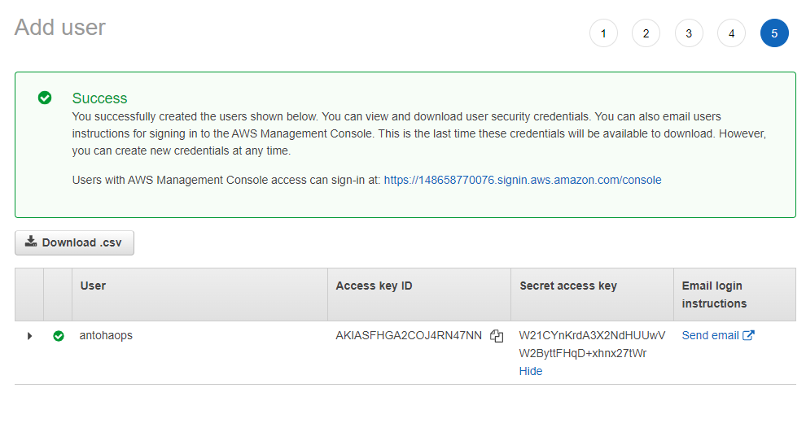

+ *Применяем наш созданный `AWS Access Key ID` и `AWS Secret Access Key` через командную строку на `Ubuntu` и ложим в один из файликов `json, yaml, table, text` и проверяем*


```shell
$ aws configure
$ aws configure list
$ aws configure list-profiles
```


+ *Создать `Role` для `EC2` и `AWS Managment CLI` чтобы они могли вызывать другие сервисы в AWS. Это сделал в `IAM` То есть, по сути этим мы предоставляем права достпупа пользователям или сервисам, при создании виртуалки EC2 нужно выбрать, если мы хотим чтобы сервис работал ограниченно, но можно поставить и `None`*

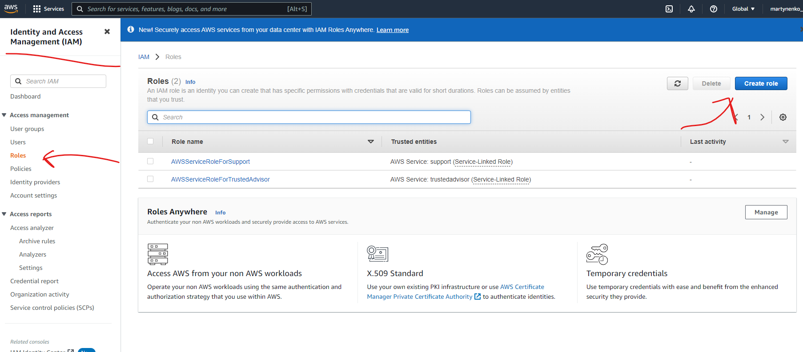

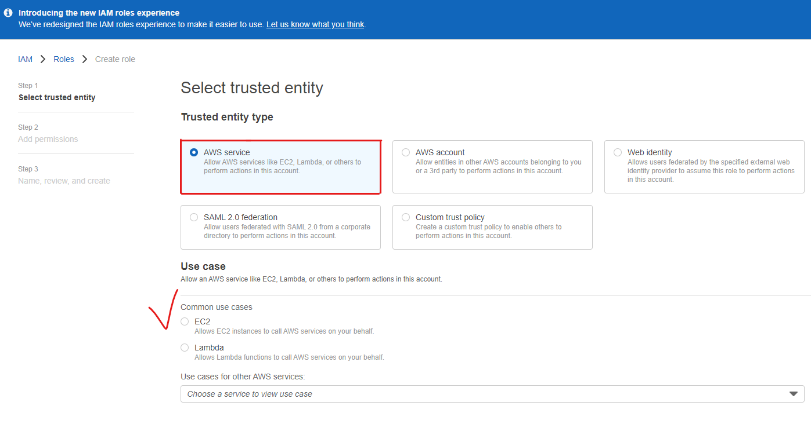

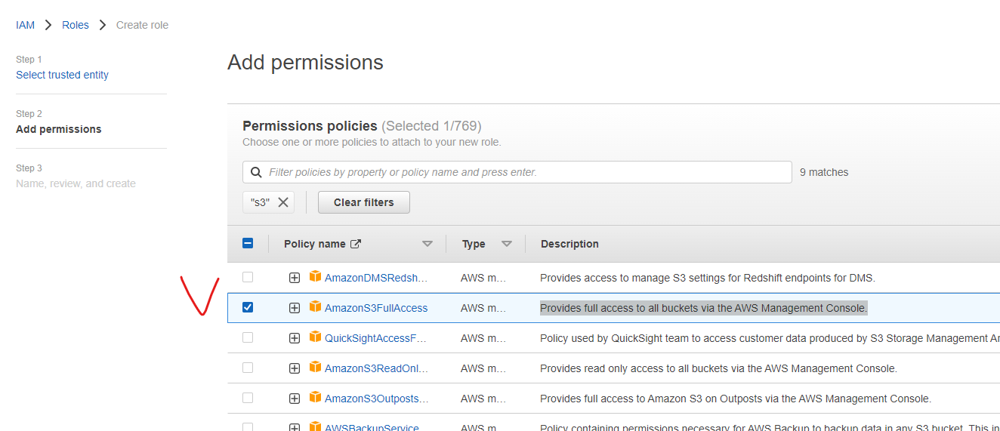


+ *Также я поковырялся в `security group` там можно ограничить передачу трафика по определенным протоколам, я создал такое правило для `SSH` `HTTP` `HTTPs` доступ по ним к нашим виртуалкам с любого адреса, но это тоже можно ограничить. Потом можно назначить это правило для все 3х `EC2`*

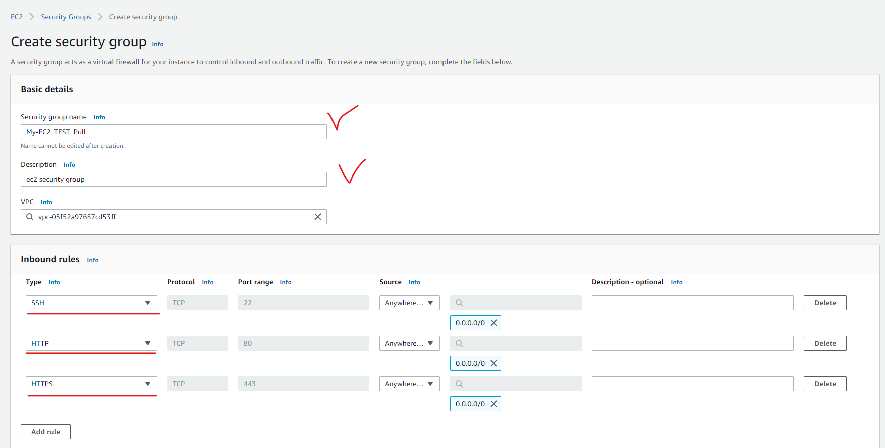

+ *Создать 3 `ЕС2` (Amazon Elastic Compute Cloud) в `Console Home - EC2 - Launch Instance`  позволяющий пользователю арендовать виртуальный сервер в разных `avlability zone` (`us-east-2c, us-east-2b, us-east-2a`) и не запускать*

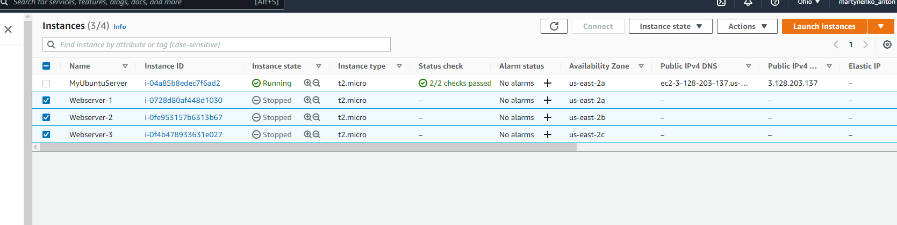

+ *Создать `S3` и положить туда 3 разных html страницы Amazon Simple Storage Service (S3) — это сервис хранения данных, предлагаемый Amazon. Вы можете думать о S3 как о веб-платформе, предоставляемой Amazon, где вы можете хранить файлы и любые другие типы данных в облаке. По умолчанию при создании снять галочки с блокировки публичного доступа к нашему бакету*

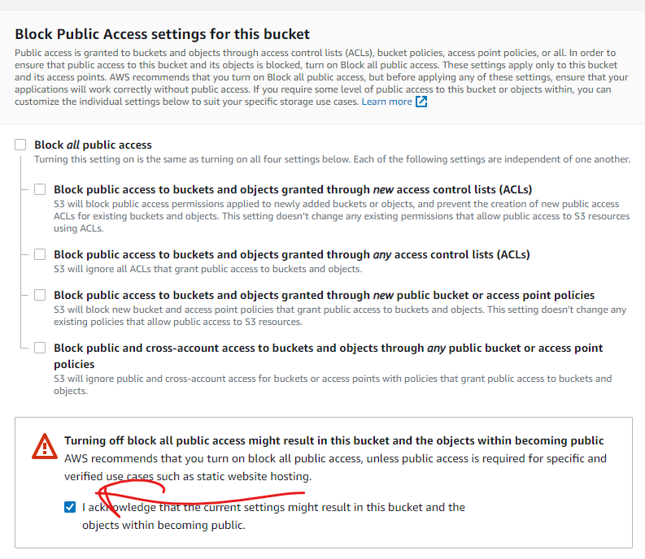

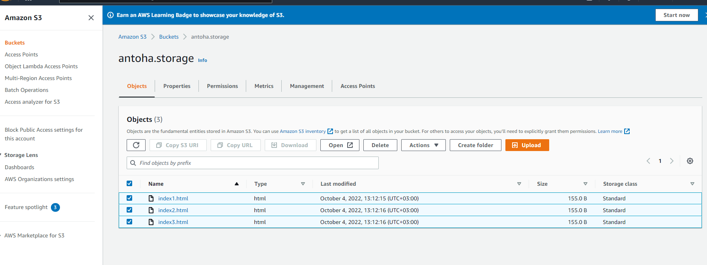

```html
<html>
<p>Hello World!</p>
<p>Welcome to my website-1&nbsp;this is my first <strong>s3</strong> static hosted site-1.</p>
<p>&nbsp;</p>
</html>

<html>
<p>Hello World!</p>
<p>Welcome to my website-2&nbsp;this is my first <strong>s3</strong> static hosted site-2.</p>
<p>&nbsp;</p>
</html>

<html>
<p>Hello World!</p>
<p>Welcome to my website-3&nbsp;this is my first <strong>s3</strong> static hosted site-3.</p>
<p>&nbsp;</p>
</html>
```

+ *Написать скрипты `userdata` для каждой `EC2` которые будут вытягивать в `S3` нужный нам html файл и ложить его в директорию с которой работает сервер `Apache`, который нужно установить и запустить.*

```shell
#!/bin/bash
yum -y update 
yum -y install httpd
aws s3 cp s3://antoha.storage/index1.html /var/www/html/index1.html
sudo service httpd start
chkconfig httpd on

#!/bin/bash
yum -y update 
yum -y install httpd
aws s3 cp s3://antoha.storage/index2.html /var/www/html/index2.html
sudo service httpd start
chkconfig httpd on

#!/bin/bash
yum -y update 
yum -y install httpd
aws s3 cp s3://antoha.storage/index3.html /var/www/html/index3.html
sudo service httpd start
chkconfig httpd on
```

*Так же, есть вариант с синхронизацией двух директорий на `S3` и `EC2`*


```shell
#!/bin/bash
sudo su
yum update -y
yum install httpd -y
yum install -y awscli
chkconfig httpd on
cd /var/www/html
aws s3 sync s3://antoha.storage/какая-то папка /var/www/html
service httpd start
```

+ *Создать и отконфигурировать `Application Load Balancer` во вкладке `EC2 - Load Balancing` и перед этим поднять виртуалки с прописанной `userdata`. Load Balancer должен быть `Internet-facing` с доступом в интернет*


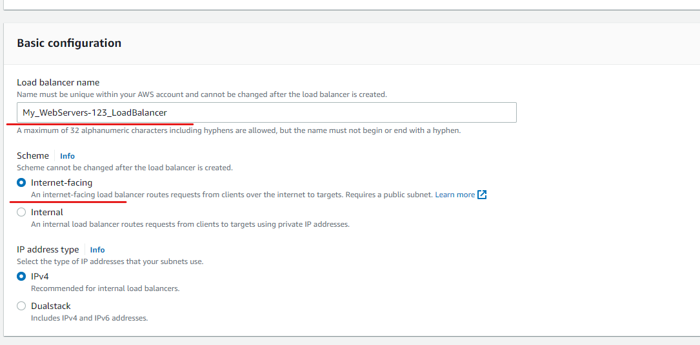


+ *Создать до определения портов на которые мы будем обращатся к `Load Balancer` - `target group`, то есть, на какой порт он будет форвардидб пакеты для `WebServers`, добавить их в группу.При настройке `LoadBalancer` как `listener` на порту 443 потребует создание сертификатов.*


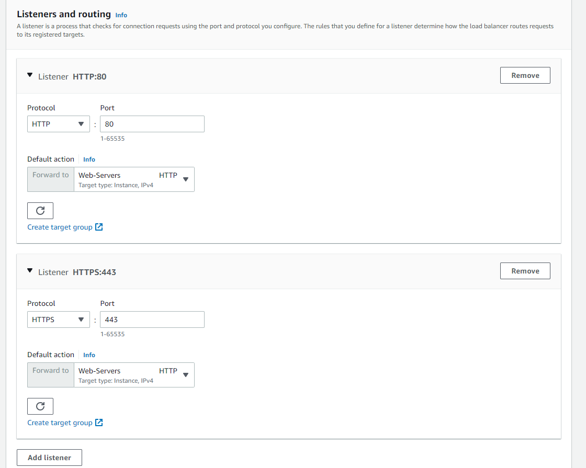

+ *Указать в какие подсети каких `avilability zone` будет пересылаться трафик*

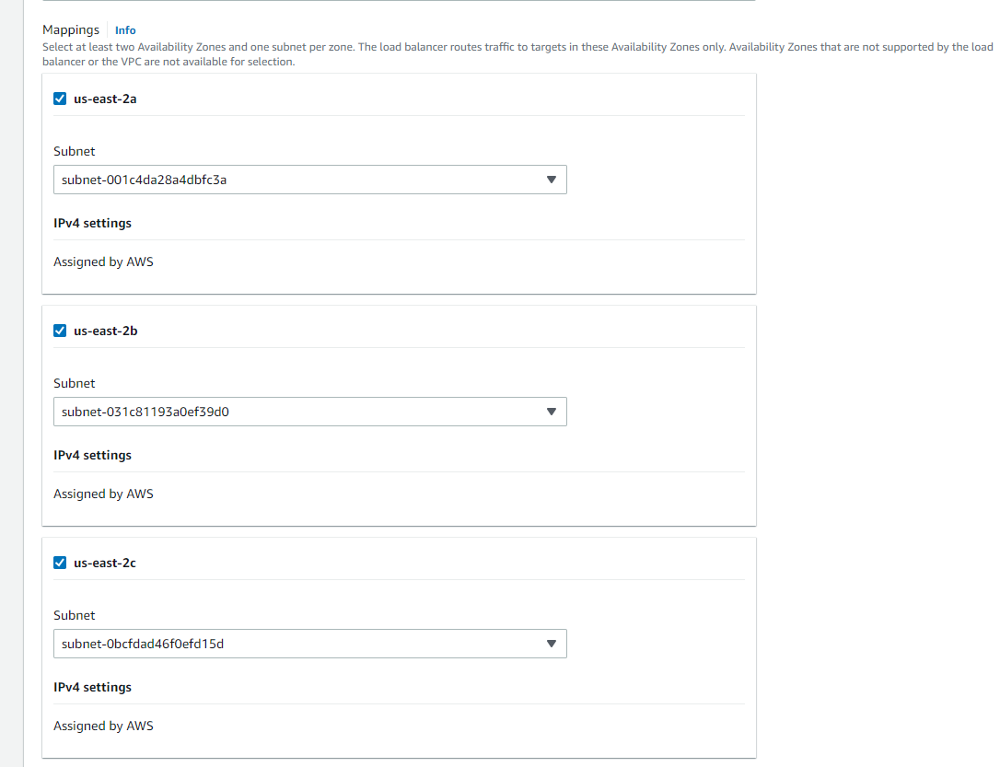

#!/bin/bash
sudo su
yum update -y
yum install httpd -y
chkconfig httpd on
aws s3 cp s3://antoha.storage/index1.html /var/www/html/index1.html
service httpd start