## ***Launching RDS and EC2 instances in a VPC using Terraform***


  *`AWS CodeDeploy` — это полностью управляемый сервис развертывания, который автоматизирует развертывание программного обеспечения в различных вычислительных сервисах, таких как Amazon EC2, AWS Fargate, AWS Lambda, и на ваших локальных серверах.*

*`Amazon Relational Database Service (RDS)` упрощает создание и эксплуатацию, а также помогает масштабировать реляционную базу данных в облаке `AWS`.*
___

### *Установка Terraform на Ubuntu*

+ *Обновляем пакетный менеджер apt и устанавливаем софт по работе с GPG ключами*

```sh
$ sudo apt-get update && sudo apt-get install -y gnupg software-properties-common curl
```

+ *Скачиваем GPG ключ и добавляем его в систему:*

```sh
$ curl -fsSL https://apt.releases.hashicorp.com/gpg | sudo apt-key add -
```

+ *Добавляем Hashicorp репозиторий в apt*
  

```sh
$ sudo apt-add-repository "deb [arch=amd64] https://apt.releases.hashicorp.com $(lsb_release -cs) main"
```

+ *Обновляем apt-репозитории ещё раз и устанавливаем Terraform:*

```sh
$ sudo apt-get update && sudo apt-get install terraform
```

+ *Проверка*
 
```sh
$ terraform -v
```

___


### *Основные шаги для любой базовой задачи*

 
*Мы начинаем с нашего `«desired state»`, которое представляет собой набор ресурсов инфраструктуры, которые мы хотим создать. Когда мы запускаем команду `plan`, `Terraform `получает актуальную информацию о ресурсах от провайдера и сравнивает ее с `«desired state»`. Затем он выводит отчет, содержащий изменения, которые произойдут при применении конфигурации (на этапе применения).*

+ *Создать локально файл который будет описывать состояние инфраструктуры.*


```shell
$ mkdir testterraform && cd ./testterraform

$ touch main.tf
```


+ *Инициализировать рабочую область с помощью команды:*

```shell
$ terraform init
```

+ *Создать план с помощью*

```sh
$ terraform plan
```

+ *Применить план*

```sh
$ terraform apply
```


+ *`Terraform` будет строить нашу инфраструктуру с нескольких файлов и я решил их разделить. Первое - мы должны упомянуть, что мы хотим использовать провайдера `aws`  в файле `main.tf`, а так же, версию и ключи для `AWS CLI` которые можно ввести либо задать через переменную `var` в файле `variables.tf` .*

```shell
terraform {
  required_providers {
    aws = {
      source  = "hashicorp/aws"
      version = "~> 4.0.0"
    }
  }

  required_version = ">= 1.3.2"
}

provider "aws" {
  profile    = "default"
  region     = var.aws_region
  access_key = var.access_key
  secret_key = var.secret_key
}
```

+ *Дальше нужно создать виртуальную сеть `VPC` с диапазонов адресов в сети `CIDR blocks` `10.0.0.0/16` добавить туда две подсети: `Private Subnet` c диапазоном `10.0.100.0/24` и `Public Subnet` с диапазоном `10.0.200.0/24`, в первой будет крутиться сервер, а во второй лежать база данных. Создать `Route table` чтобы можно было все пакеты в интернет из сети отправлять на `Internet Gateway`. Для `Private subnet` добавить `NAT Gateway`, адреса на `NAT` будут пересылаться на `Internet Gateway`, сам `NAT` будет находиться в `Public subnet`. Приатачить правило для `NAT` к таблице роутинга для `Private Subnet`. Cоздать постоянный айпи адрес `Elastic IP`  и накинуть его на `NAT`. И прикрепить таблицы роутинга к подсетям. В файле `network.tf`*

```shell
resource "aws_vpc" "main" {
     cidr_block = "10.0.0.0/16"
     enable_dns_hostnames = "true"
     enable_dns_support   = "true"

     tags = {
         Name = "Environment-VPC"
  }
}

resource "aws_subnet" "main_public" {
     vpc_id                  = aws_vpc.main.id
     cidr_block              = var.vpc_cidr_public
     availability_zone       = "${var.aws_region}a"
     map_public_ip_on_launch = true

     tags = {
         Name = "Public-subnet"
 }
}

resource "aws_subnet" "main_private" {
     vpc_id                  = aws_vpc.main.id
     cidr_block              = var.vpc_cidr_private
     availability_zone       = "${var.aws_region}b"
     map_public_ip_on_launch = true

     tags = {
         Name = "Private-network"

 }
}

resource "aws_internet_gateway" "gateway" {
     vpc_id = "${aws_vpc.main.id}"

     tags = {
         Name = "internet-gateway"
  }
}

resource "aws_eip" "lb" {
     vpc = true
     depends_on = [aws_internet_gateway.gateway]
}

resource "aws_nat_gateway" "natgateway" {
     allocation_id = aws_eip.lb.id
     subnet_id     = aws_subnet.main_public.id

     tags = {
         Name = "Gateway-NAT"
  }

     depends_on = [aws_internet_gateway.gateway]
}

resource "aws_route_table" "public" {
     vpc_id = aws_vpc.main.id

  route {
     cidr_block = "0.0.0.0/0"
     gateway_id = aws_internet_gateway.gateway.id
  }

     tags = {
         Name = "Public-routetable"
  }
}

resource "aws_route_table" "private" {
     vpc_id = aws_vpc.main.id

  route {
     cidr_block = "0.0.0.0/0"
     gateway_id = aws_nat_gateway.natgateway.id
  }

     tags =  {
         Name = "Private-routetable"
  }
}

resource "aws_route_table_association" "public" {
     count          = "${length(var.vpc_cidr_public)}"
     subnet_id      = "${element(aws_subnet.main_public.*.id, count.index)}"
     route_table_id = "${aws_route_table.public.id}"
}

resource "aws_route_table_association" "private" {
     count          = "${length(var.vpc_cidr_private)}"
     subnet_id      = "${element(aws_subnet.main_private.*.id, count.index)}"
     route_table_id = "${aws_route_table.private.id}"
}
```

+ *Дальше, сгенерировать ключи `ssh`, сделать так чтобы `EC2` создавалась с публичным ключем, а приватный ложился в локальной директории, так же пооткрывать порты для трафика для c помощью `sequrity group`. Поднять вируталку с уже установленой `userdata`, можно вынести ее отдельным файлом и сослаться на скрипт. Либо загрузить ее в вируалку через `remote-exec` (ниже будут примеры). Далее устанавливаем соединение по `ssh` и ложим туда ключ приватный. Файл `EC2.tf`*

***Пример решения `ssh` части***

```sh
resource "tls_private_key" "pk" {
  algorithm = "RSA"
  rsa_bits  = 4096
}

resource "aws_key_pair" "kp" {
  key_name   = "myKey"       # Create "myKey" to AWS!!
  public_key = tls_private_key.pk.public_key_openssh

  provisioner "local-exec" { # Create "myKey.pem" to your computer!!
    command = "echo '${tls_private_key.pk.private_key_pem}' > ./myKey.pem"
  }
}
```
***Пример решения `userdata` части***

```sh
resource "aws_instance" "mytfinstance" {
  ami           = lookup(var.AMIS, var.AWS_REGION)
  instance_type = "t2.micro"
  key_name      = aws_key_pair.key121.key_name

  provisioner "file" {
    source      = "script.sh"
    destination = "/tmp/script.sh"
  }

  provisioner "remote-exec" {
    inline = [
      "chmod +x /tmp/script.sh",
      "sudo /tmp/script.sh"
    ]
  }

  connection {
    type        = "ssh"
    user        = var.INSTANCE_USERNAME
    private_key = tls_private_key.oskey.private_key_pem
    host        = aws_instance.mytfinstance.public_ip
  }
}
```

*`EC2.tf`*

```sh
resource "tls_private_key" "key" {
         algorithm = "RSA"
         rsa_bits  = 4096
}         

resource "local_sensitive_file" "private_key" {
         filename          = pathexpand("/root/testterraform/mykey.pem")
         content = tls_private_key.key.private_key_pem
         file_permission   = "0400"
         directory_permission = "700"
}

resource "aws_key_pair" "key_pair" {
         key_name   = "Mykeys"
         public_key = tls_private_key.key.public_key_openssh
}

resource "aws_security_group" "webserver-security-group" {
         name             = "allow_ssh"
         description      = "Allow ssh inbound traffic"
         vpc_id           = aws_vpc.main.id
         depends_on       = [aws_vpc.main]

     ingress {
         from_port        = 22
         to_port          = 22
         protocol         = "tcp"
         description      = "Telnet"
         cidr_blocks      = ["0.0.0.0/0"]
    }
    
     ingress {
         from_port        = 80
         to_port          = 80
         protocol         = "tcp"
         description      = "HTTP"
         cidr_blocks      = ["0.0.0.0/0"]
    }

     ingress {
         from_port        = 443
         to_port          = 443
         protocol         = "tcp"
         description      = "HTTPS"
         cidr_blocks      = ["0.0.0.0/0"]
    }
    
     ingress {
         from_port        = 3306
         to_port          = 3306
         protocol         = "tcp"
         description      = "MySQL"
         cidr_blocks      = ["0.0.0.0/0"]
    }

     egress {
         from_port        = 0
         to_port          = 0
         protocol         = "-1"
         cidr_blocks      = ["0.0.0.0/0"]
  }
}

resource "aws_instance" "web_instance" {
         ami                         = var.instance_ami
         instance_type               = var.instance_type
         key_name                    = "Mykeys"
         security_groups             = [aws_security_group.webserver-security-group.id]
         subnet_id                   = aws_subnet.main_public.id
         associate_public_ip_address = true
         user_data = <<-EOF
             #!/bin/bash 

             sudo yum -y install httpd php mysql php-mysql

             case $(ps -p 1 -o comm | tail -1) in
             systemd) sudo systemctl enable --now httpd ;;
             init) sudo chkconfig httpd on; sudo service httpd start ;;
             *) echo "Error starting httpd (OS not using init or systemd)." 2>&1
             esac

             if [ ! -f /var/www/html/bootcamp-app.tar.gz ]; then
             cd /var/www/html
             sudo wget https://s3.amazonaws.com/immersionday-labs/bootcamp-app.tar
             tar xvf bootcamp-app.tar
             sudo chown apache:root /var/www/html/rds.conf.php
             fi
             sudo yum -y update
         EOF

    lifecycle {
         create_before_destroy = true
  }
    tags = {

    Name = "EC2-configuration"
  }
     

provisioner "file" {
         source      = "/root/testterraform/mykey.pem"
         destination = "/home/ec2-user/mykey.pem"

connection {
         type        = "ssh"
         user        = "ec2-user"
         private_key = tls_private_key.key.private_key_pem
         host        = aws_instance.web_instance.public_ip
    }
}

provisioner "remote-exec" {
         inline = ["chmod 400 ~/mykey.pem"]
connection {
         type        = "ssh"
         user        = "ec2-user"
         private_key = tls_private_key.key.private_key_pem
         host        = aws_instance.web_instance.public_ip
    }
} 

}
```

* *Подымаем ресурс `RDS` в файле `RDS.tf` и добаляем ее `subnet group` в двух `avilability zone`, база данных будет находиться на порту 3306 который мы открывали ранее. Можно установить `snapshot` для базы*

```sh

resource "aws_db_subnet_group" "subnet-group" {
         name       = "main"
         subnet_ids = [aws_subnet.main_public.id, aws_subnet.main_private.id]

}

resource "aws_db_instance" "rds-instance" {
         allocated_storage       = 20
         db_name                 = "mydb"
         db_subnet_group_name    = aws_db_subnet_group.subnet-group.id
         engine                  = "mysql"
         engine_version          = "5.7"
         instance_class          = "db.t2.micro"
         username                = "admin"
         password                = "anton123"
         parameter_group_name    = "default.mysql5.7"
         port                    = 3306
         publicly_accessible     = false
         storage_type            = "gp2"
         vpc_security_group_ids = [aws_security_group.webserver-security-group.id]
         skip_final_snapshot       = true
         tags = {

    Name = "Example-RDSServer-Instance"
  }
}
```

+ *Также я написал файл отдельно для переменных на которые ссылаюсь `variables.tf`, если нам нужно задать несколько значений то используем `list`*

```sh
variable "access_key" {
      description = "Access key to AWS console"
}
variable "secret_key" {
      description = "Secret key to AWS console"
}

variable "aws_region" {
      description = "region for lauch resourses"
      default     = "us-east-2"
      type        = string
}

variable "vpc_cidr" {
      description = "virual network for two subnets"
      default     = "10.0.0.0/16"
      type        = string
}

variable "vpc_cidr_public" {
      description = "Public subnet"
      default     = "10.0.100.0/24"
      type        = string
}

variable "vpc_cidr_private" {
      description = "Private subnet"
      default     = "10.0.200.0/24"
      type        = string
}

variable "instance_type" {
      type        = string
      default     = "t2.micro"
}

variable "instance_ami" {
      type        = string
      default     = "ami-0f924dc71d44d23e2"
} 
```

+ *И был создан отдельный файл с выводами важных значений например какой будет айпи у виртуалки после создания, это все будет выводиться в консоль, атрбибуты того что выводить можно искать на `HashiCorp`. Файл `outputs.tf`*

```sh
output "my-aws-public-subnet-id" {
         value = aws_subnet.main_public.id
}

output "my-aws-private-subnet-id" {
         value = aws_subnet.main_private.id
}

output "my-public-ip-gateway" {
         value = aws_eip.lb.public_ip
}

output "my-allocation-id-natgateway" {
         value = aws_nat_gateway.natgateway.public_ip
}

output "list-objects-route-table-public" {
         value = aws_route_table.public.route
}

output "list-objects-route-table-private" {
         value = aws_route_table.private.route
}

output "ssh_keypair" {
         value = tls_private_key.key.private_key_pem
         sensitive = true
}

output "key_name" {
         value = aws_key_pair.key_pair.key_name
}

output "public_ip_my_instance" {
         value = aws_instance.web_instance.public_ip
}

output "RDS_ENDPOINT" {
         value = aws_db_instance.rds-instance.endpoint

}
```

+ *Дальше создаем ресурсы и исправляем ошибки на этапах план и аплай*

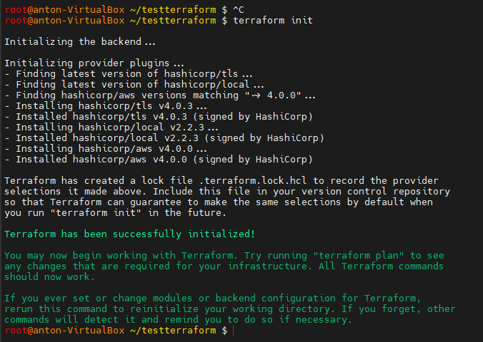

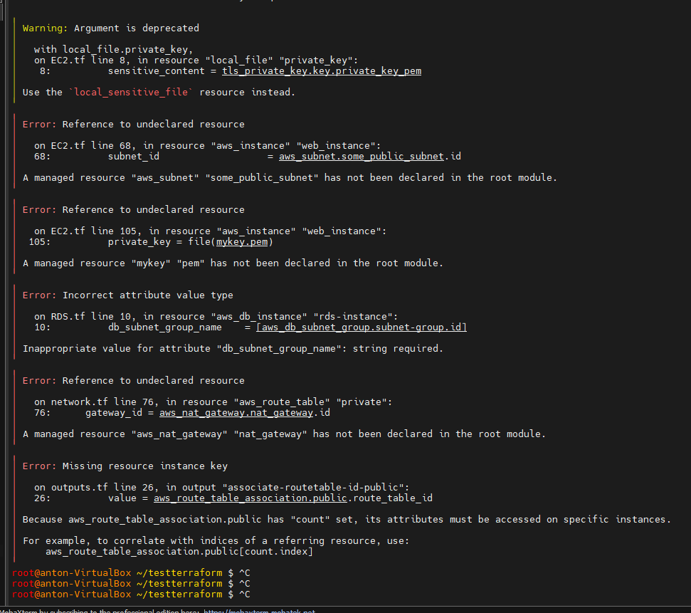

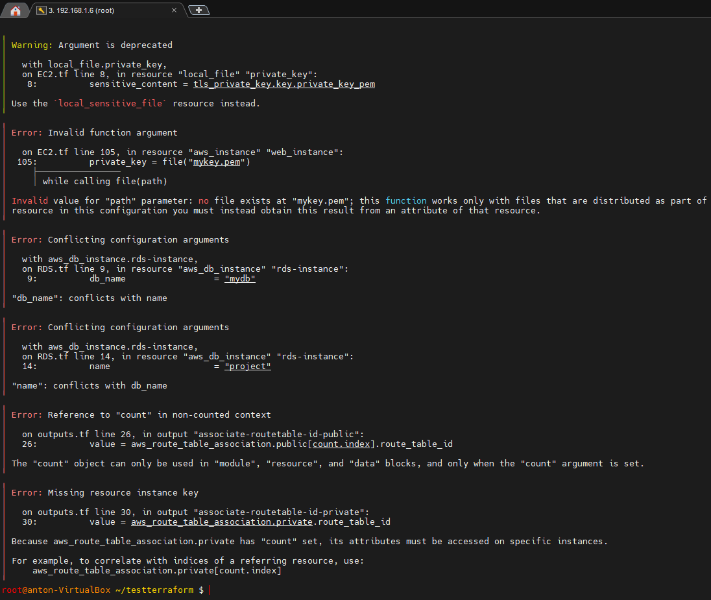

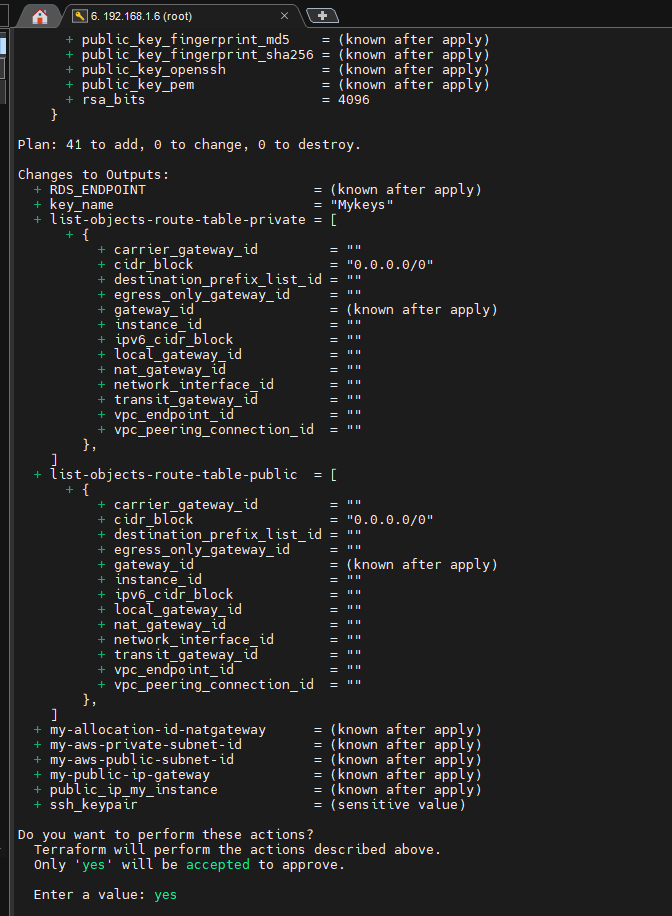

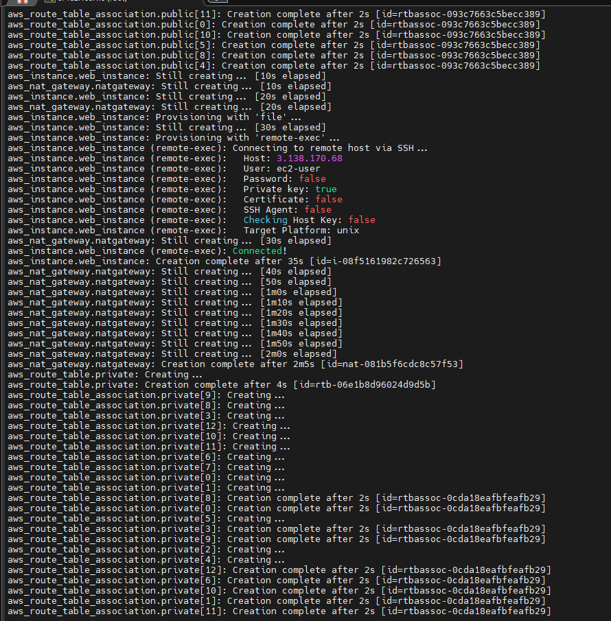

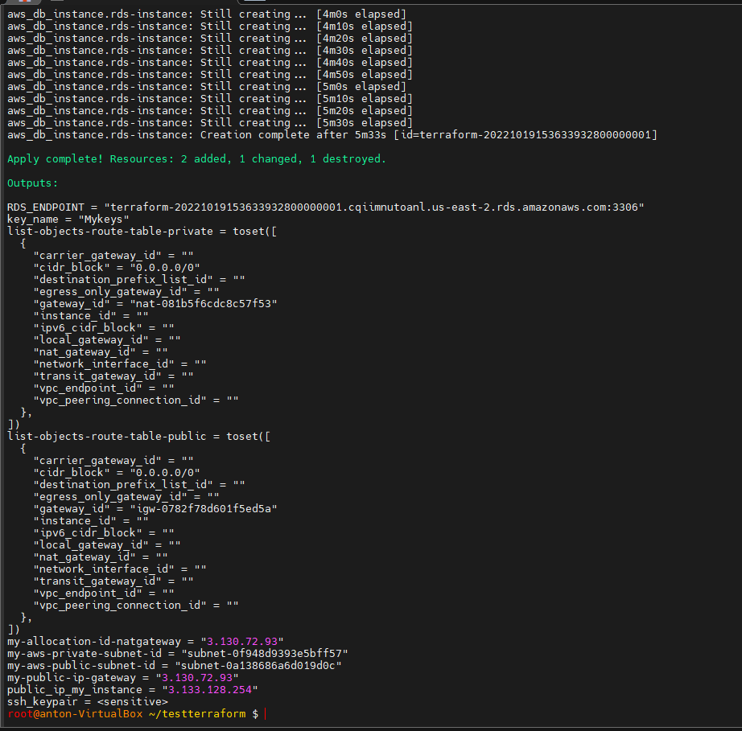

+ *Проверка создаваемых ресурсов*

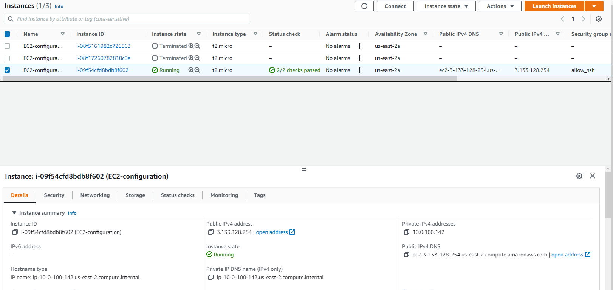

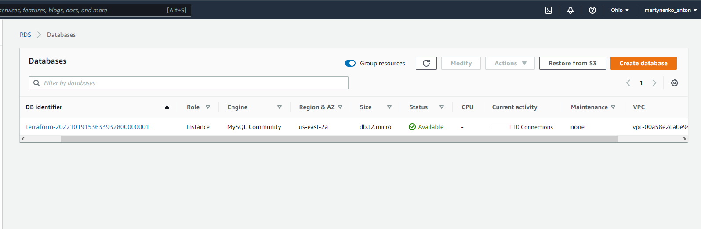

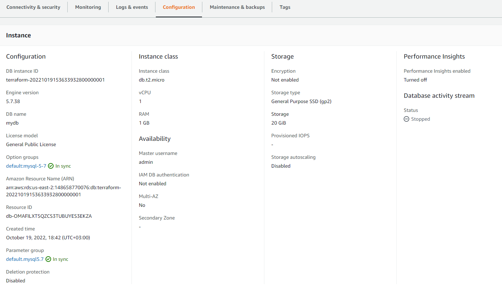

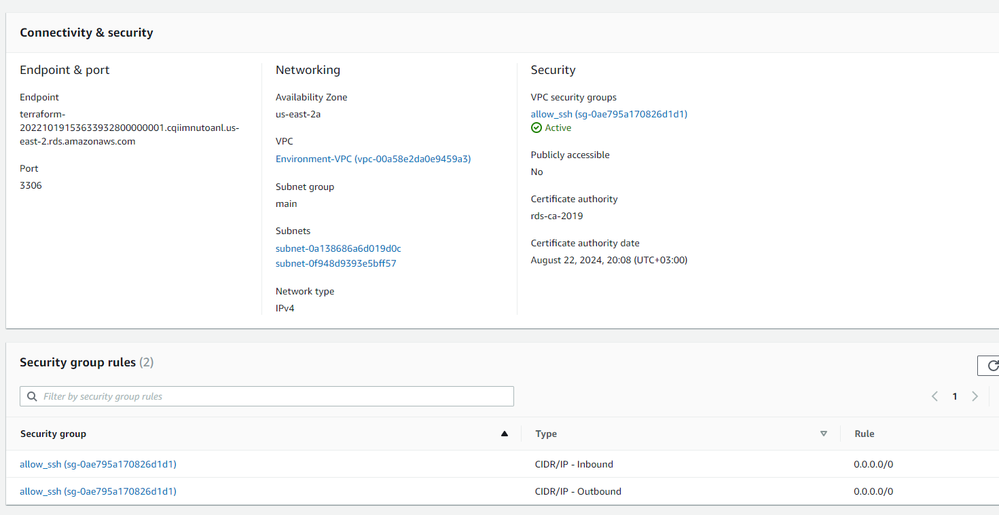

+ *Проверка сети и доступности и ответа сервера с другой виртуалки в `AWS` и моего хоста на винде. А так же проверка работы сервера через логин по `ssh`, наличие ключей, и кода скопированного с `S3`*

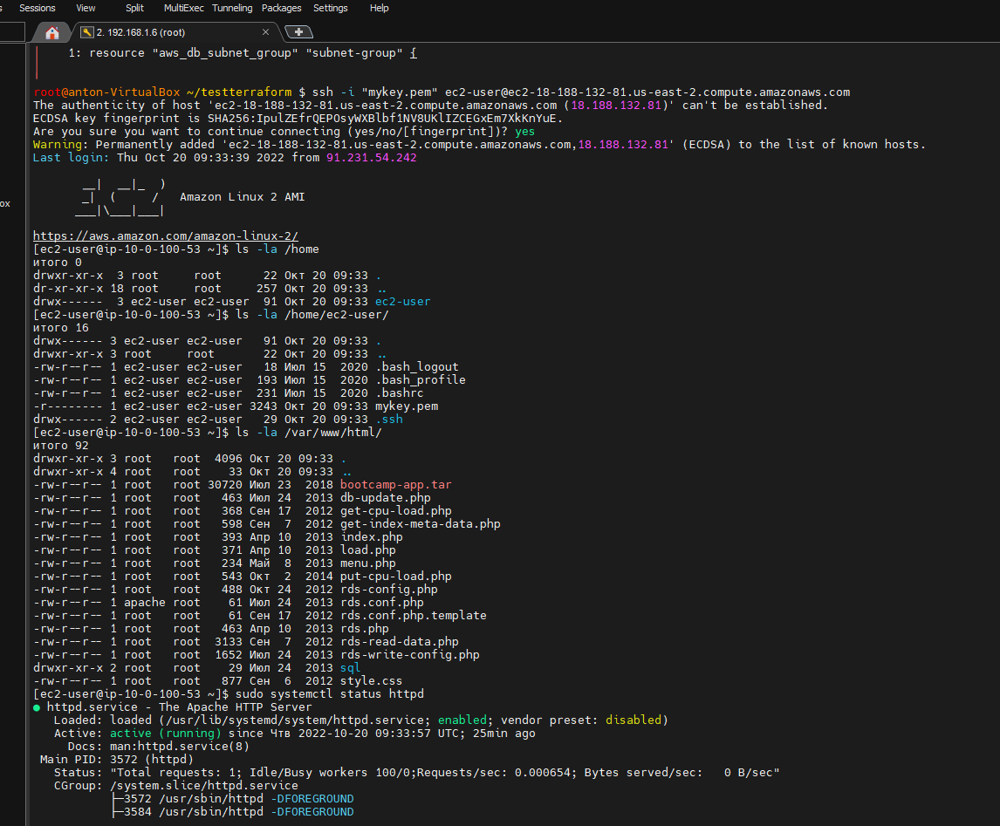

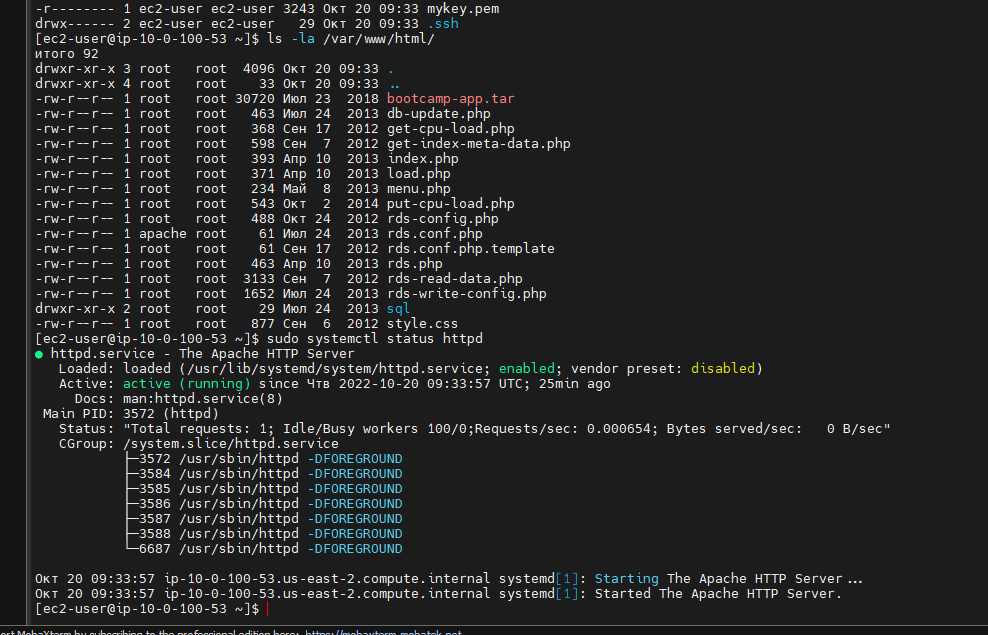

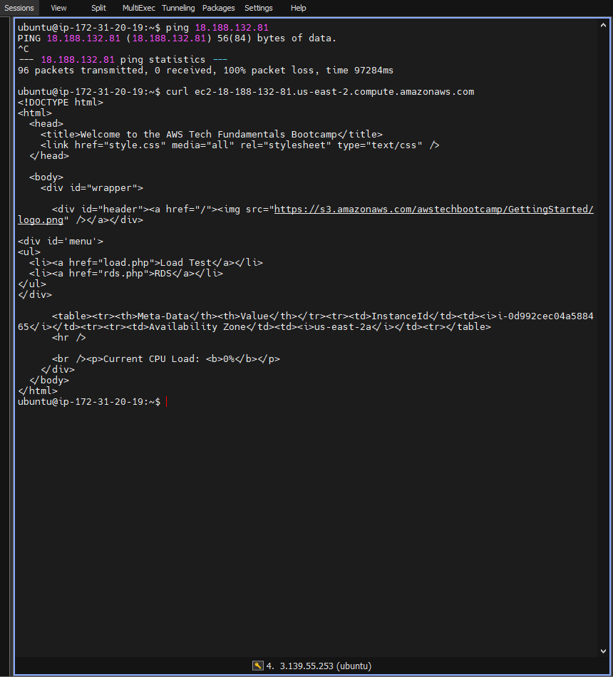

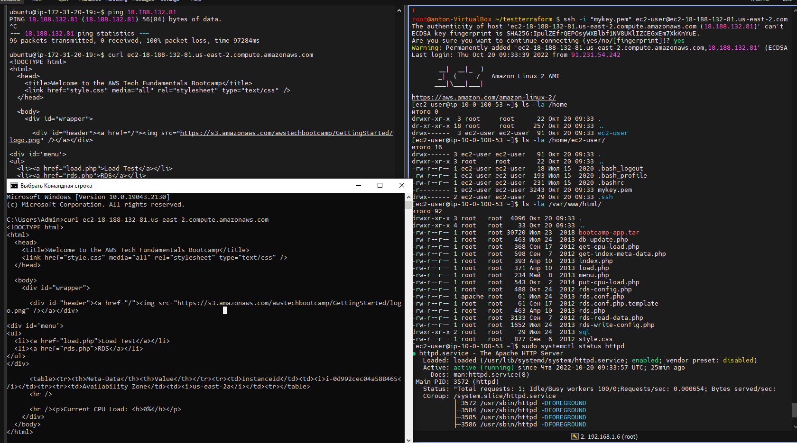

+ *Дальше удаляем созданые ресурсы `terraform destroy` Так же можно заметить что удалился фаайл состояния с которого `terraform` читает что нам нужно было создать `terrform.tfstate`*

***Destroy complete! Resources: 39 destroyed.***

#### ***Полезные ссылки для меня:***

*1. https://rotadev.com/how-do-i-create-an-ssh-key-in-terraform-dev/*

*2. https://www.linkedin.com/pulse/creating-key-pair-ec2-instance-running-script-using-terraform-pant/*

*3. https://awstip.com/iac-with-terraform-and-aws-part-4-ec2-instance-basics-with-cloud-init-f901d0200387*

*4. https://awstip.com/how-to-create-custom-ec2-vpcs-in-aws-using-terraform-df647fc36503*

*5. https://avabodha.in/create-your-first-aws-ec2-instance-using-terraform/*

*6. https://awstip.com/iac-with-terraform-and-aws-part-2-creating-public-and-private-subnets-within-a-vpc-d318ab1b46a9*

*7. https://medium.com/appgambit/terraform-aws-vpc-with-private-public-subnets-with-nat-4094ad2ab331*

*8. https://khandelwalsanskruti98.medium.com/launching-rds-and-ec2-instances-in-a-vpc-using-terraform-c9de7f443856*

*9. https://www.linkedin.com/pulse/how-setup-sample-php-web-service-ec2-rds-auto-scaling-arindam-debray/*

*10. https://dev.to/rolfstreefkerk/how-to-setup-a-basic-vpc-with-ec2-and-rds-using-terraform-3jij*

*11. https://medium.com/strategio/using-terraform-to-create-aws-vpc-ec2-and-rds-instances-c7f3aa416133*

