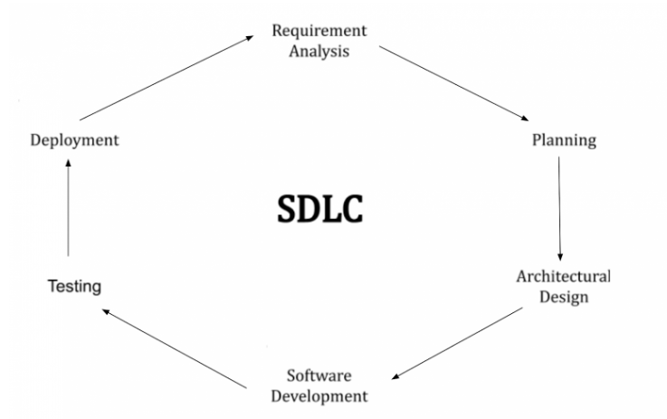
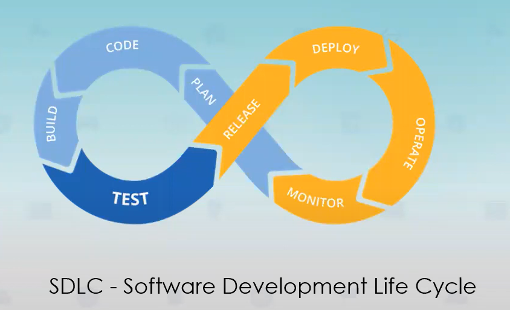
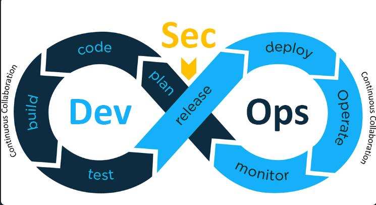

*Как я понял, указанная выше SDLC для Devops произошла вот с этой
методологии:*

*Они не заменяют друг друга, а дополняют. SDLC -- жизненный цикл
программного обеспечения. В целом, SDLC это такой замкнутый цикл, в
котором каждый этап влияет на действия в последующих и дает
перспективные указания на будущее. И его основная цель повысить уровень
надежности и стабильность релизов, а также ускорить время затраченное на
эти процессы.*

-   *1 этап - `код`. Написание и покрытие это кода тестами, закомитить и запушить в систему контроля версий, например GIT.*

-   *2 этап - `билд`. Система, например Jenkins, автоматически соберет изменения и запускает их тестирование.*

-   *3 этап - `тест`. После автоматических тестов, если нужно, изменения отдаются в ручное тестирование.*

-   *4 этап - `релиз`. После того как команда тестировщиков проверила все изменения и у нас получилась стабильная версия продукта. Этой версии присваивается номер и она становится релиз-кандидатом.*

-   *5 этап - `деплой`. Нашу релизную ветку мы загружаем и разворачиваем на продакшн сервере заказчика.*

-   *6, 7 этап - `operate, monitor`. На этом этапе следим за развернутой версией продукта, стабилизируем ее и фиксим. Обновления операционных систем, исправления безопасности и службы интеграции меняются почти каждый день. Управление такого рода обновлениями даже при новых развертываниях важно для обеспечения бесперебойной доступности системы.*

-   *8 этап - `план`. Планируем новый функционал и собираем данные для корректировок новой версии. Основная задача понять что можно улучшить.*

 ***Источники:***

 [*[https://www.linkedin.com/pulse/improving-software-development-process-through-devops-sami-el-tahawy/]{.underline}*](https://www.linkedin.com/pulse/improving-software-development-process-through-devops-sami-el-tahawy/)

[*[https://habr.com/ru/company/dcmiran/blog/521718/]{.underline}*](https://habr.com/ru/company/dcmiran/blog/521718/)
