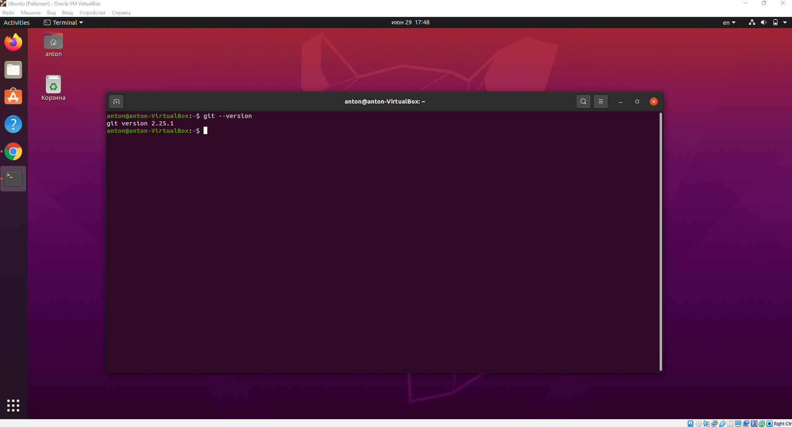
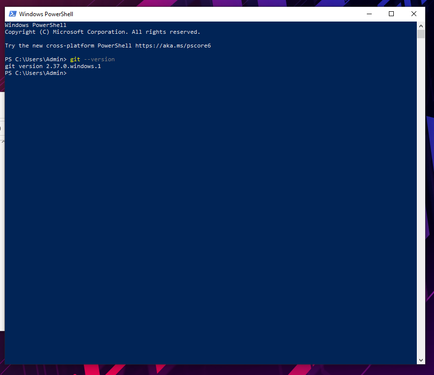
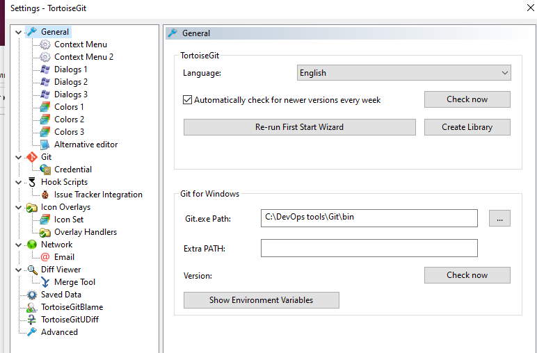
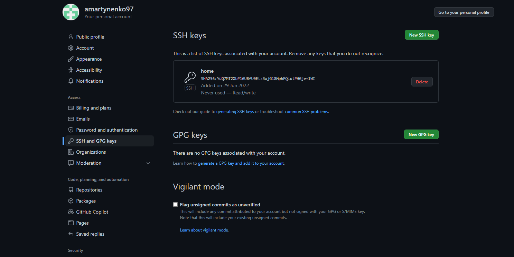
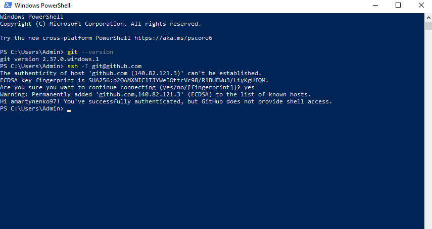
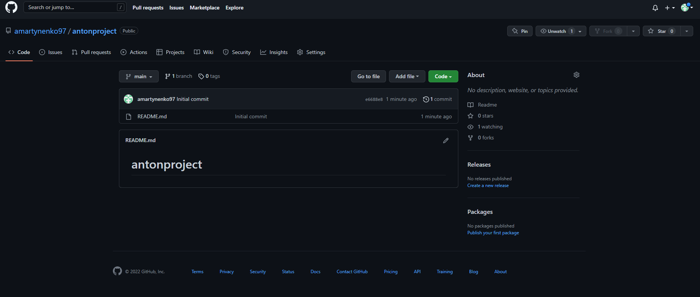

*У меня установлен был клиент Git 2.25.1 на виртуалке Ubuntu + я
установил на свой хост версия 2.37.0.windows.1*

*Ещё установил TortoiseGit - расширение оболочки Windows для управления Git.*

*Создал пару ключей для Windows и публичный ключ закинул на сервер
GitHub. По этой инструкции:*

*https://docs.github.com/en/authentication/connecting-to-github-with-ssh/generating-a-new-ssh-key-and-adding-it-to-the-ssh-agent*

*Проверил соединение с сервером, все работает.*
 

*Создал публичный репозиторий с одним файлом `readme`.*

