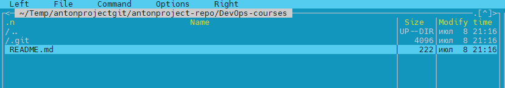
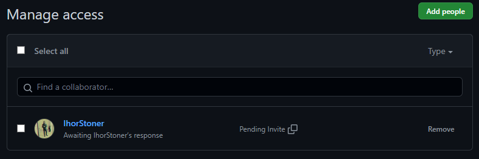
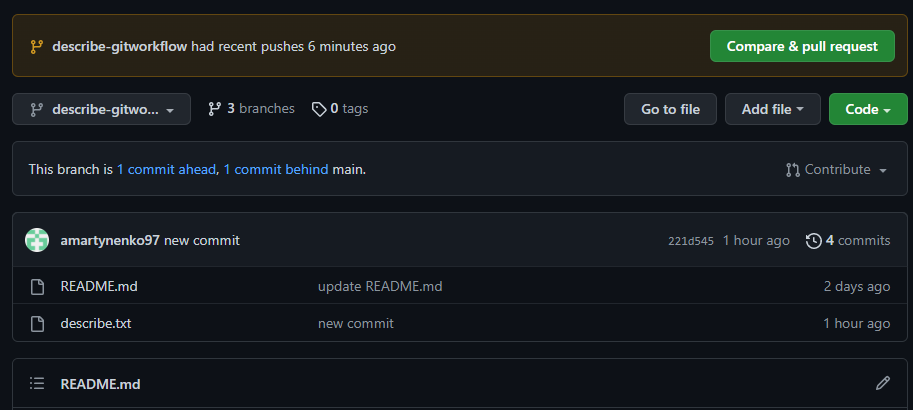
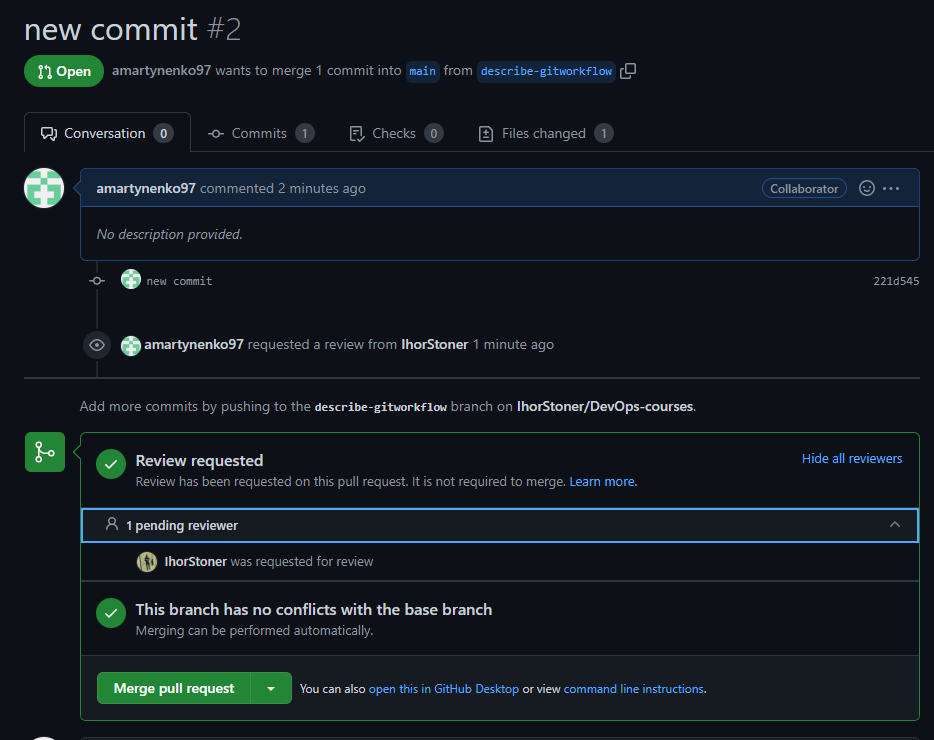

*1. Начал с того что выполнил команду `git clone` https://github.com/IhorStoner/DevOps-courses.git репозитория своего напарника по HTTP https://github.com/IhorStoner/DevOps-courses/tree/git-workflow и он появился соответсвенно у меня в локальном репо.*



*2. Дальше дал доступ на коллаборацию в GitHub. И пришлось создать __PAT__ (Personal Access Token) для аутентификации Git через HTTPS.*

*Settings ➔ Developer Settings ➔ Personal Access Token ➔ Generate New Token (Give your password) ➔ Fillup the form ➔ click Generate token ➔ Copy the generated Token*



*3. Дальше работаю с локальным репозиторием. Создаю ветку ➔ `git branch describe-gitworkflow` и `git checkout describe-gitworkflow`. Создаю файл `describe.txt` с описанием gitflow напарника:*

>*The partner in his project will use `Gitflow Workflow`*
>
> *First, for convenience, you can install the Git-flow extension*
>
> *\$git flow init*
>
> *GitFlow is a collection of Git commands to provide many repository
> operations with just single command.*
>
> *Anything in the master branch is deployable and is stable.*
>
> *To work on something new, create a branch off from master and given
> a descriptive name(new_feature).*
>
> *Also, you can create branches from the existing feature branch.*
>
> *Commit to that branch locally and regularly push your work to the
> same-named branch on the server.*
>
> *When you need feedback or help, or you think the branch is ready
> for merging, open a pull request.*
>
> *After someone else has reviewed and signed off on the feature, you
> can merge it into master.*
>
> *Once it is merged and pushed to master, Your feature is ready for
> deployment.*
>
+ *Соответственно после этого пушу в репо напарника.*

```c
git add describe.txt
git commit -m "new commit"
git push \--set-upstream origin describe-gitworkflow
```



4.  *Создал `pull request` и добавил ревьюера https://github.com/IhorStoner/DevOps-courses/pull/2



*После того как Игорь проверит, я сделаю `merge` в основную ветку. Стяну все изменения ➔ ___git pull___ и удалю ветку командой ➔ ___git branch delete describe-gitworkflow___*
