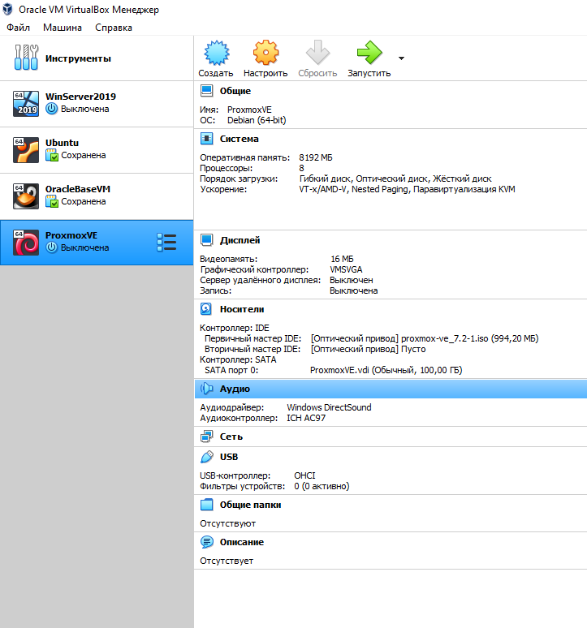
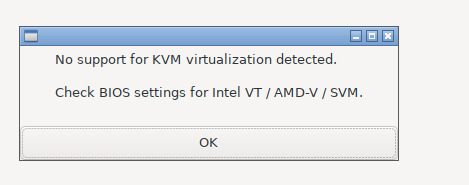
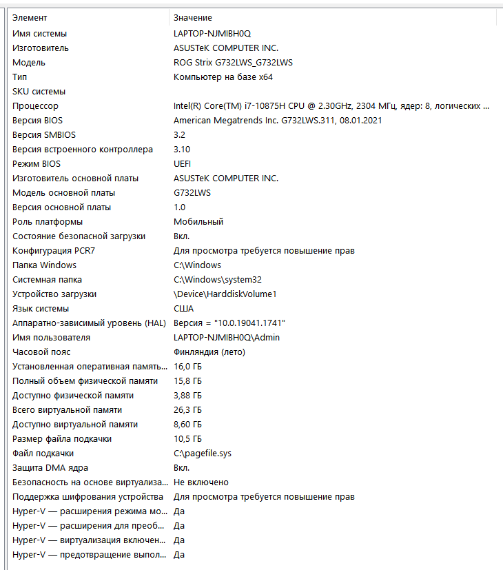
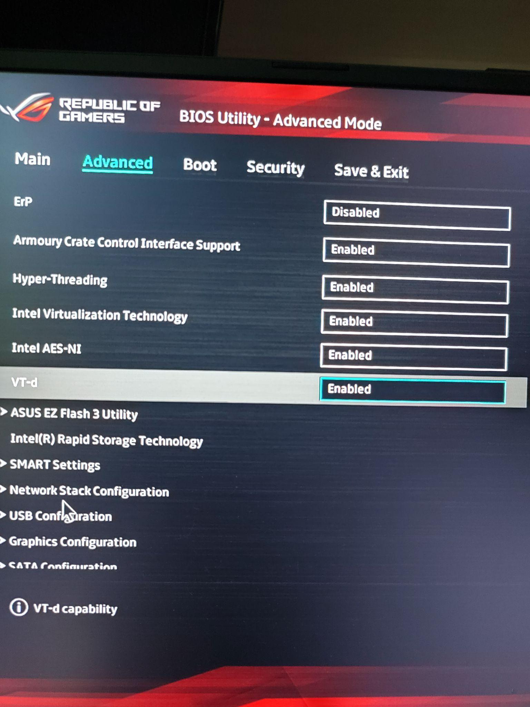
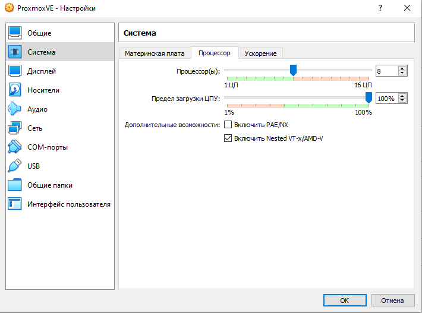
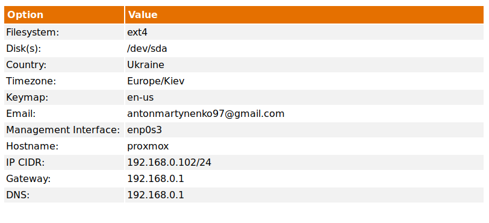
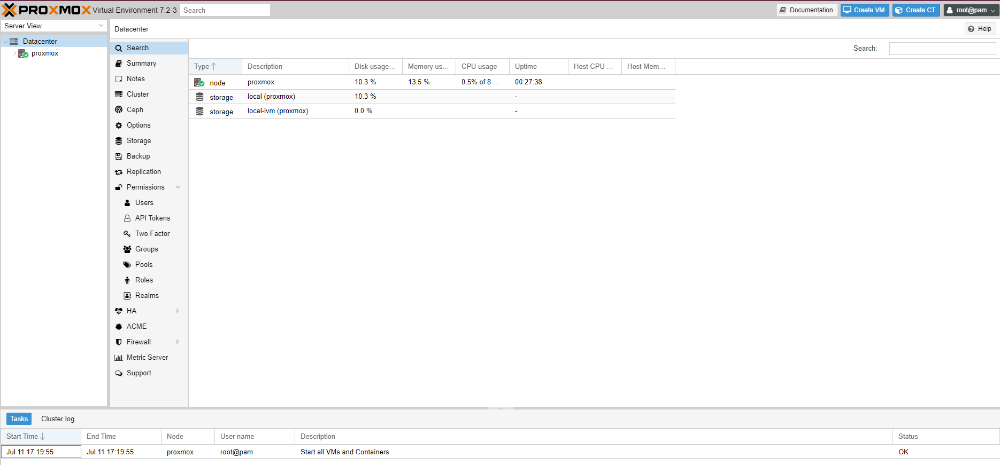
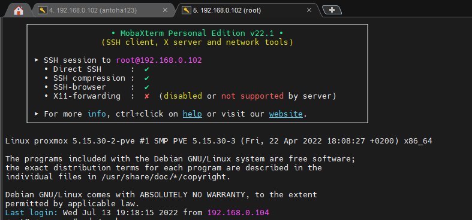

Установил образ Proxmox гипервизора на VirtualBox гипервизор, вот с такими настройками, в настройках сети выбрал - сетевой мост. Дальше при запуске вылезла такая ошибка:

Это означает, что параметры аппаратного ускорения, необходимые процессору для поддержки виртуализации, в настоящее время отключены в моем BIOS.

> VT/AMD-V/SVM - это расширения набора инструкций, которые обеспечивают аппаратную поддержку мониторов виртуальных машин. Они позволяют запускать полностью изолированные виртуальные машины на аппаратных скоростях для некоторых рабочих нагрузок. 

Дальше в сведениях о системе проверил режим BIOS.

Сходив в BIOS, в расширенном режиме обнаружил что все включено.

Потом нашел ответ на свой вопрос, полазив в настройках VirtualBox и включив `Nested VT-x/AMD-v`. Причина в том, что для работы вложенной виртуализации первый гипервизор должен передать второму некоторые возможности процессора (Intel VT-x или AMD-V).

Начальные настройки для Proxmox. После перезагрузки выбрал старт с жесткого диска.

После установки не мог получить соединение с веб-интерфейсом Proxmox,задача решалась 2 способами, можно было добавить ip адрес из подсети виртуальной машины в сетевой адаптер хостовой, вот по этой инструкции https://help.oclc.org/Library_Management/EZproxy/Technical_notes/Add_a_second_IP_address_to_an_existing_network_adapter_on_Windows?sl=en

https://www.youtube.com/watch?v=iXzLVYsMhkI

Я решил переустановить Proxmox и задать IP CIDR из той подсети в которой находится сетевой мост и виртуальная машина.

SSH для юзера и рута работает

