Для загрузки образа Debian я воспользовался этим ресурсом https://www.debian.org/releases/ и загрузил его на хостовую машину. Потом установил **FileZilla** https://filezilla.ru/get/ и с помощью ее по протоколу SFTP копирую ранее скачанный образ виртуалки на удаленный сервер Proxmox в директорию `/var/lib/vz/template/iso`

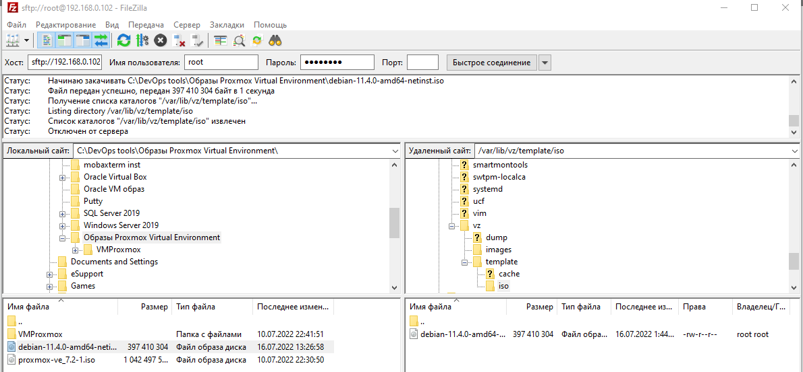

И сразу же, создаю виртуалку с образа на Proxmox.


https://www.youtube.com/watch?v=OUC7DMBfR3Y устанавливал по этой инструкции. В конце, нужно переключить запуск с жесткого диска. Но при установке вылазит вот такая ошибка: `Bad Mirrors` Первое что сделал, это отключил на хостовой машине (Windows), через редактор региста включил **IP forwarding**.

https://support.tetcos.com/support/solutions/articles/14000098272-how-to-enable-ip-forwarding-in-windows-for-emulation-using-netsim-

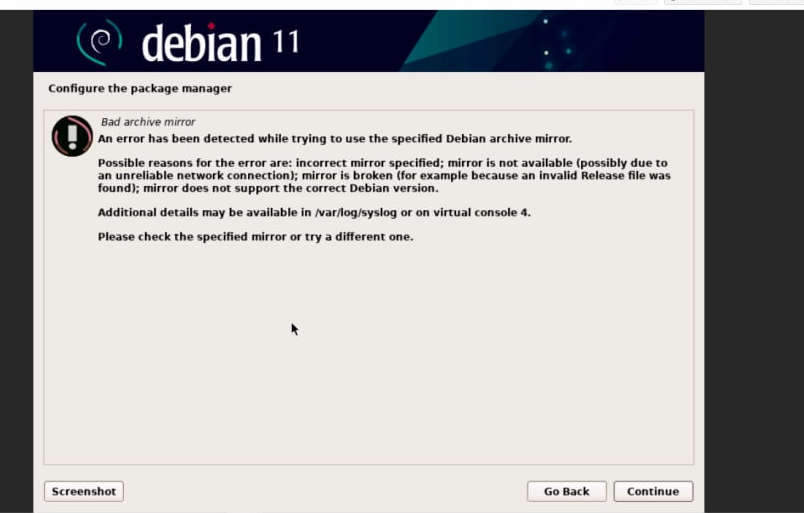

Потом на ProxmoxVE включаем IP forwarding тоже:

```c
# nano /etc/sysctl.conf
net.ipv4.ip_forward = 1
# sysctl -p
```

Дальше в этом файле на proxmox нужно добавить IP моей виртуалки, для
того чтобы после перезагрузки сервера она имела доступ к сети.

```c
# nano /etc/network/interfaces
# systemctl restart networking
```

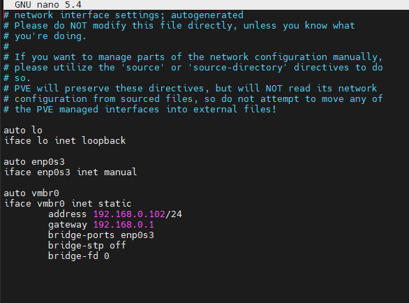

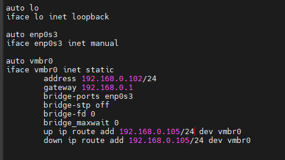

На самой ВМ Debian11 файлик изначально выглядел так

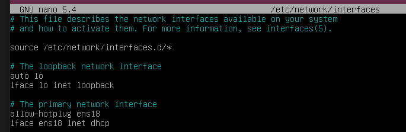

Я добавил строки. Попробовал 2 варианта. Сначала gateway с выходом на
роутер, а потом с выходом на гипервизор.

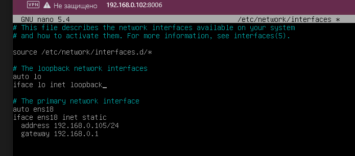

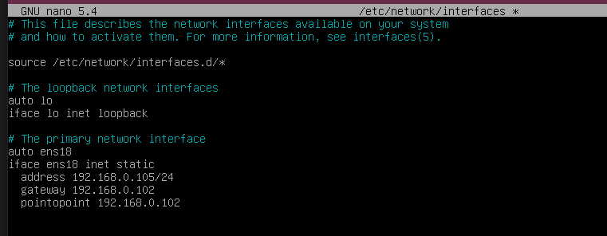

В этом файлике ВМ Debian11 тоже добавил ссылки на репы моей версии
дебиана вот с этого сайта https://wiki.debian.org/SourcesList

```c
# nano /etc/apt/sources.list
```

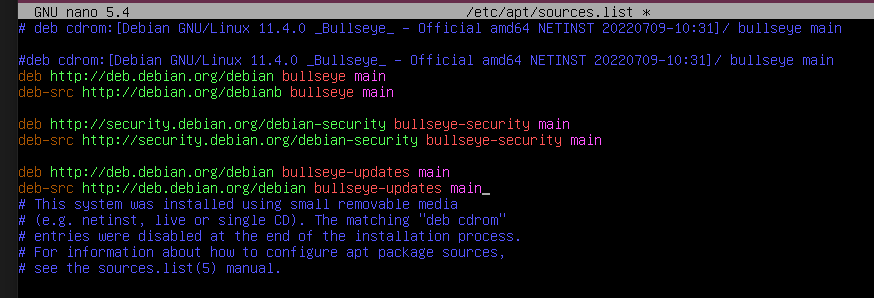

Добавил адреса DNS сервера. Так чтобы соответствовало, тому что
добавлено на самом Proxmox.

```c
# nano /etc/resolv.conf
```

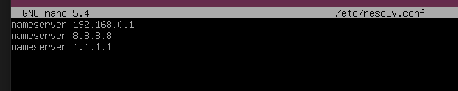

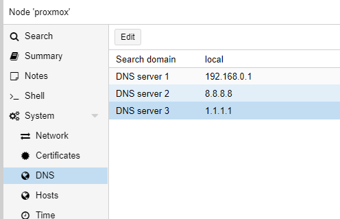

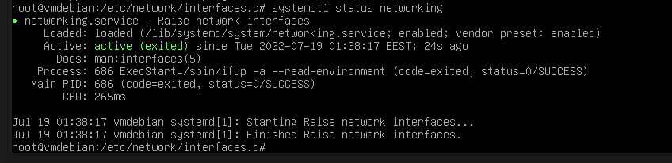

### ***Попытка №2***

Установил debian-11.4.0-amd64-DVD-1 образ https://ostechnix.com/create-proxmox-virtual-machines/,
дальше вылезло окошко `"Bad archive mirror"` я его пропустил. Зашел в систему в файлик `interfaces`

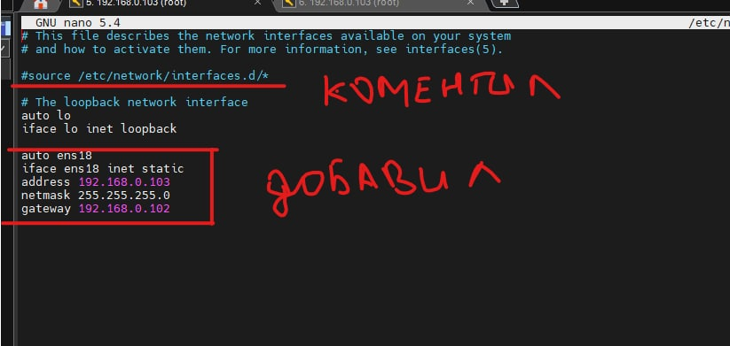


После ребута нетворка появилась проблема что не пингуется эта виртуалка с proxmox. А с виртуалки на proxmox все проходит. После этого всего добавил ip route (и из консоли и в файле interfaces на Proxmox). И теперь могу с ВМ пинговать Proxmox и с Proxmox - ВМ, но до шлюза роутера дело не доходит. Трейс с ВМ, попадает на Proxmox и дальше никуда.

Итог, форвардинг на всех узлах включен `/etc/sysctl.conf`, фаерволы
отключены.

Правило на Proxmox
```
iptables -t nat -A POSTROUTING -s 192.168.0.107 -o vmbr0 -j MASQUERADE

iptables -t nat -F
```
Не работает.

"Неразборчивый режим включен" на VirtualBox.

В файлах `/etc/resolv.conf` ,прописан выход на DNS сервер на gate маршрутизатора 192.168.0.1 и публичный 8.8.8.8.

Если нужно чтобы виртуальной машине не автоконфигурировал DNS сервер айпишник и можно было настроить вручную. Пользуемся неграфической установкой ВМ, на этапе сетапа сети можно скипнуть и отменить этот шаг.

https://lowendspirit.com/discussion/3933/how-to-create-and-setup-a-debian-kvm-vps-with-proxmox-ve-6-part-iii-network-configuration

https://lowendspirit.com/discussion/3917/how-to-create-and-setup-a-debian-kvm-vps-with-proxmox-ve-6-part-ii-debian-install

https://1dedic.ru/knowledge_base/nastroyka-seti-v-proxmox-na-vydelennykh-serverakh-s-vpu

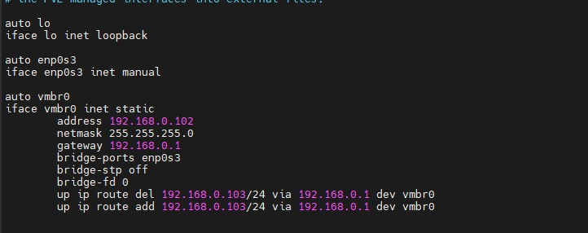

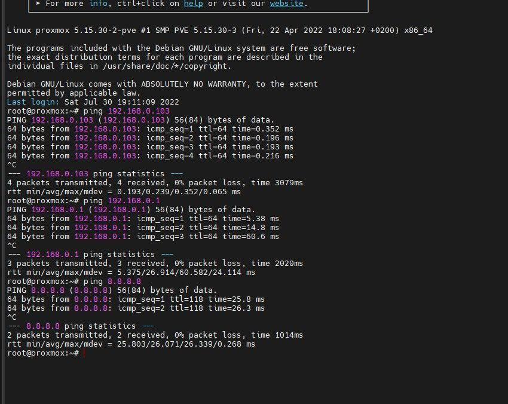

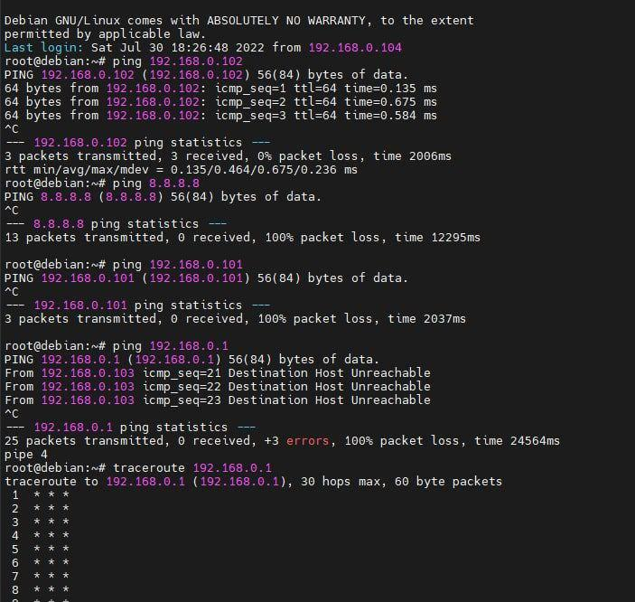

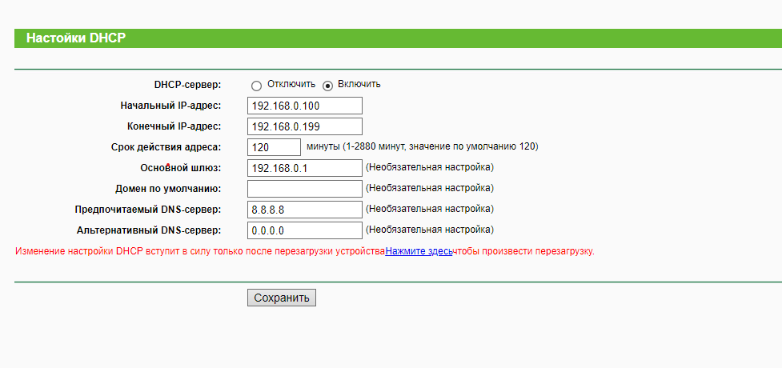

___

#### 2. Пробую установить Proxmox Turnkey Jenkins из темплейтов. Используя команды и выбираю нужный темплейт, для того чтобы его подгрузить локально в память proxmox.

```c
# pveam update\
# pveam available\
# pveam available \| grep jenkins\
# pveam download local debian-10-turnkey-jenkins_16.1-1_amd64.tar.gz
```
Выдало такую ошибку:

```c
\--2022-07-16 03:19:11\-- 
http://mirror.turnkeylinux.org/turnkeylinux/images/proxmox/debian-10-turnkey-jenkins_16.1-1_amd64.tar.gz\
Resolving mirror.turnkeylinux.org (mirror.turnkeylinux.org)\... failed:Temporary failure in name resolution.download failed: wget: unable to resolve host address \'mirror.turnkeylinux.org
```

Была проблема с DNS и я добавил еще один 8.8.8.8 получилось скачать по
пути `/var/lib/vz/template/cache/`. И создать контейнер.

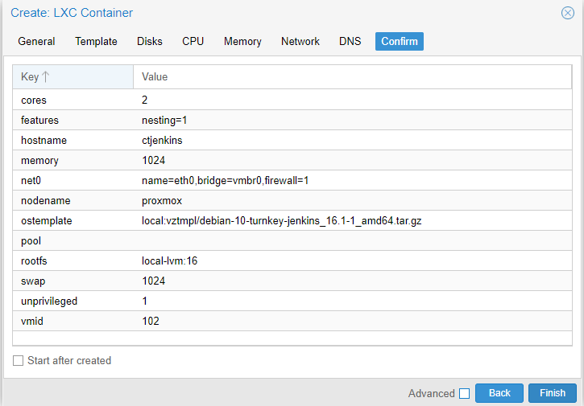

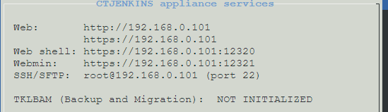

Отлично, веб интерфейс Jenkins по https://192.168.0.101) работает.


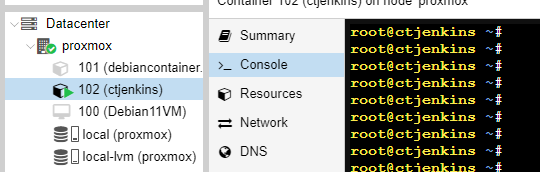

#### 3. Пробую устанавливать Proxmox на VirtualBox с режимом сети NAT.

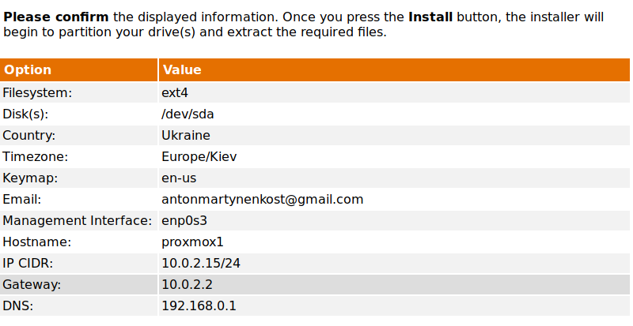

После установки задаем правило порт форвардинг айпи из сети из-за NAT в нашу локальную сеть в VirtualBox. Даёт возможность подключится с нашейсети к IP за NAT

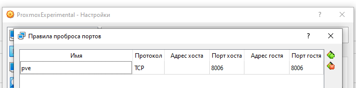

Подключились из браузера. Можно было localhost:8080

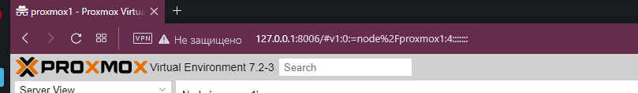

Загружаем образ с хоста


Автоконфиг по DHCP не прошел, выдало ошибку.

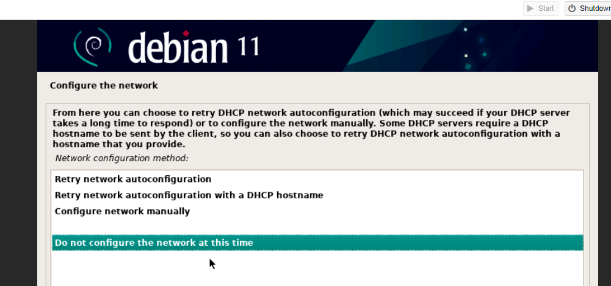

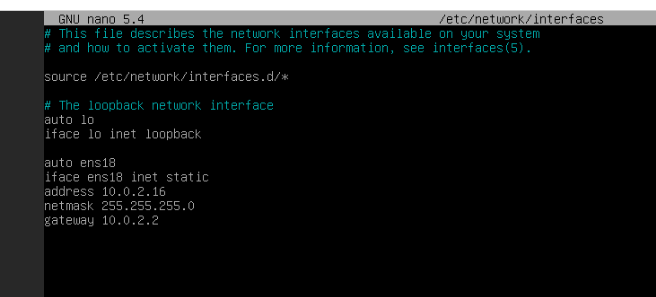

С такими настройками все заработало. Могу пинговать 8.8.8.8, 192.168.0.1

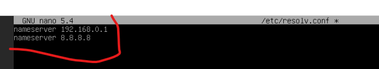

Добавляем ссылки на мирроры которые не получилось добавить при
установке.


```c
#apt update
#apt-get install openssh-server net-tools aptitude mc curl
```

https://pkg.jenkins.io/debian/ по этой инструкции был установлен Jenkins.

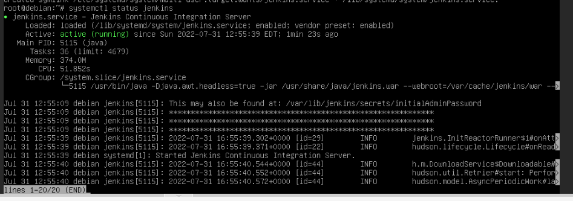

```c
#systemctl enable jenkins
#sudo systemctl start jenkins
#systemctl status jenkins
```

Вводим `http://localhost:8080`

Дальше получилось выйти на GUI (основной пользовательский интерфейс)
Jenkins по этой инструкции https://www.jenkins.io/doc/book/installing/linux/,
там еще нужно было сделать порт форвардинг в VirtualBox (8080-8080). Для
того чтобы авторизоваться от имени админа нужно было найти ключ `/var/lib/jenkins/secrets/initialAdminPassword`

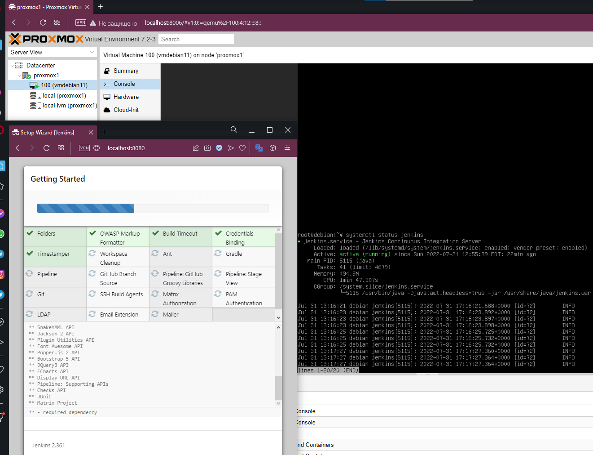

Все работает.

***user - antonmartynenko***

***Ссылки для меня:***

1. https://pve.proxmox.com/wiki/Proxmox_VE_inside_VirtualBox

2. https://unix.stackexchange.com/questions/616811/adding-persistent-routes-to-debian-10-without-restarting

3. https://support.us.ovhcloud.com/hc/en-us/articles/360002394324-How-to-Connect-a-VM-to-the-Internet-Using-Proxmox-VE

4. https://pve.proxmox.com/wiki/Network_Configuration

5. https://ru.w3docs.com/snippets/linux/kak-skopirovat-fail-s-udalennogo-servera.html

6. https://lowendspirit.com/discussion/3933/how-to-create-and-setup-a-debian-kvm-vps-with-proxmox-ve-6-part-iii-network-configuration

7. https://support.tetcos.com/support/solutions/articles/14000098272-how-to-enable-ip-forwarding-in-windows-for-emulation-using-netsim-

8. https://www.snel.com/support/debian-vm-in-proxmox-and-networking-setup/

9. https://forum.proxmox.com/threads/proxmox-as-a-virtualbox-machine-no-internet-on-vmachines.98863/

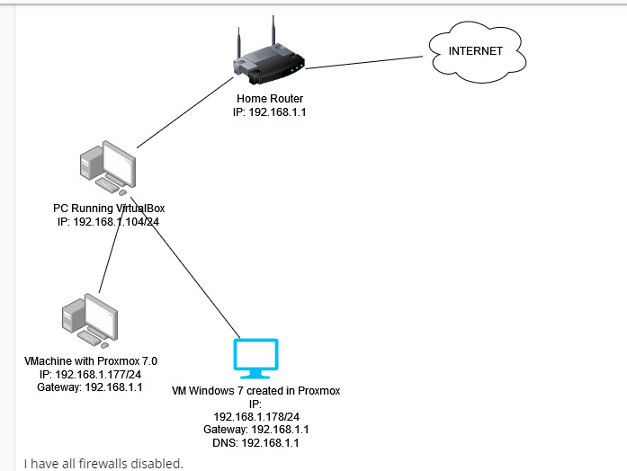
