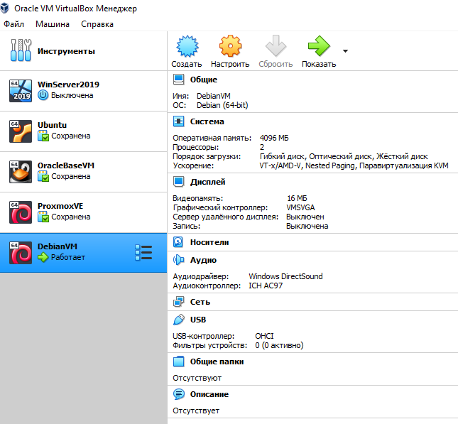
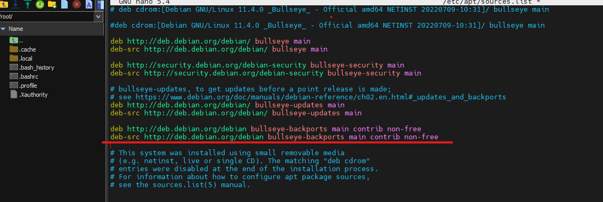
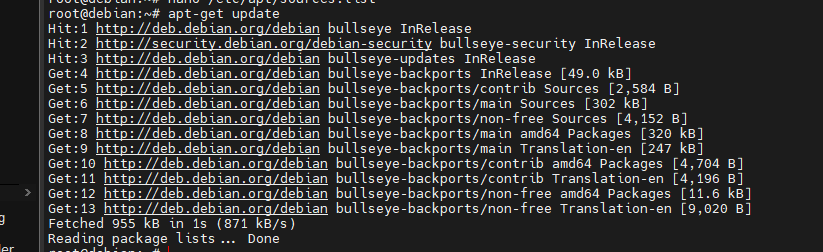
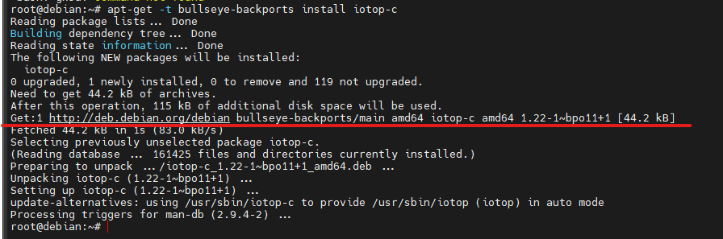
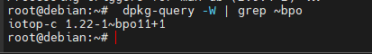
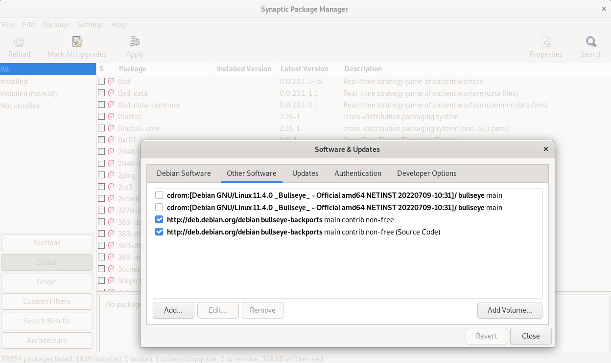

1.У меня была виртуалка Debian11 на гипервизоре VirtualBox, подключился к ней по SSH и начал работу.

2.От имени администратора (root) открыл файл `/etc/apt/sources.list` в текстовом редакторе и добавил две строчки и обновил список пакетов `# apt-get update`

Также подключены репозитории с несвободными компонентами системы, добавлены `contrib non-free`. В целом, бэкпорты подключены.

3.Для того чтобы установить нужную версию ПО можно перейти на официальный сайт по https://backports.debian.org/Packages/ найти в каком бэкпорту какого дистрибутива она лежит, скачать deb.пакет и установить его вручную.

Я решил установить утилитку iotop-c командой:

`# apt-get -t bullseye-backports install iotop-c`

Чтобы понять какие установленные пакеты являются Backports, выполнил
следующую команду:

`whereis iotop-c` - узнать где лежит исполняемый файл

`dpkg -S /usr/bin/iotop-c` - узнать информацию о том, если он был
установлен через пакетный менеджер, то какой пакет им владеет.

`dpkg -L iotop-c` - какими файликами владеет эта програмка

Есть второй способ добавить нужные нам репозитории с бэк портов - ***Synaptic Package Manager***

Добавить нужный нам бэкпорт и потом в терминале `sudo apt-get update && sudo apt-get upgrade && sudo apt-get dist-upgrade` для поиска обновлений пакетов. Дальше можно добавить нужный нам пакет с помощью вышеописанной команды.

[[https://wiki.debian.org/ru/Backports#:\~:text=Debian%20Backports%20---%20официальный%20репозиторий%20пакетов,словами%20предоставляет%20свежие%20версии%20программ]{.underline}](https://wiki.debian.org/ru/Backports#:~:text=Debian%20Backports%20%E2%80%94%20%D0%BE%D1%84%D0%B8%D1%86%D0%B8%D0%B0%D0%BB%D1%8C%D0%BD%D1%8B%D0%B9%20%D1%80%D0%B5%D0%BF%D0%BE%D0%B7%D0%B8%D1%82%D0%BE%D1%80%D0%B8%D0%B9%20%D0%BF%D0%B0%D0%BA%D0%B5%D1%82%D0%BE%D0%B2,%D1%81%D0%BB%D0%BE%D0%B2%D0%B0%D0%BC%D0%B8%20%D0%BF%D1%80%D0%B5%D0%B4%D0%BE%D1%81%D1%82%D0%B0%D0%B2%D0%BB%D1%8F%D0%B5%D1%82%20%D1%81%D0%B2%D0%B5%D0%B6%D0%B8%D0%B5%20%D0%B2%D0%B5%D1%80%D1%81%D0%B8%D0%B8%20%D0%BF%D1%80%D0%BE%D0%B3%D1%80%D0%B0%D0%BC%D0%BC).

[[https://wiki.debian.org/ru/SourcesList]{.underline}](https://wiki.debian.org/ru/SourcesList)
