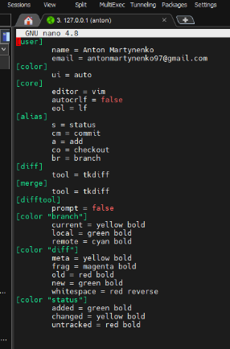

### DZ_5_Instructions for GitFlow/Hillel Academy
* ___Подготовка виртуальной машины для работы___
   _1. Начал работу с того, что установил Mobaxterm для работы с удаленными серверами с моей хостовой машины_
   _2. С помощью утилиты PuttyGen сгенерировал 2 ключа, приватный положил на хост публичный отправил в виртуалку Ubuntu в папку:_
   ```
   $ cd ~/.ssh/authorized_keys
   ```
   _3. Поменять права файла_
   ```
   $ chmod 644 authorized_keys
   ```
   _4. Редактируем файл_
   ```
   $ sudo vim /etc/ssh/sshd_config
   ```
   _5. После этого перезагрузил сервис и подключился по IP - 127.0.0.1_
   ```
   $ sudo systemctl restart sshd.service
   ```
* ___Настройка SSH для GitHub и виртуальной машины для работы___
    _1. Для работы с Github по SSH требовалось сгенерировать ключи с помощью команды:_
    ```
    $ ssh-keygen
    ```
     _2. Перейти в файлик и скопировать публичный ключ._
    ```
     $ cat ~/.ssh/id_rsa.pub
    ```
     _3. Закинуть этот ключ на удаленный сервер Github._
* ___Начало работы с Git___     
     _1. Для начала нам нужно создать глобальные настройки юзера для локального репозитория командами:_
     ```
     $ git config --global user.name "Anton Martynenko"
     $ git config --global user.email "antonmartynenko97@gmail.com"
     $ git config --global color.ui auto
     ```
     _2. Дальше, установил и настроил для гита графическую утилиту tkdiff для отслеживания изменений между двумя комитами._
     ```
     $ git config --global diff.tool tkdiff
     $ git config --global merge.tool tkdiff
     $ git config --global --add difftool.prompt false
     ```
     _3. Настроил алиасы для определенных команд:_
     ```
     $ git config --global alias.s status
     $ git config --global alias.cm commit
     $ git config --global alias.a add
     $ git config --global alias.co checkout
     $ git config --global alias.br branch
     ```
    [ссылка-пример с GitHub](https://gist.github.com/pksunkara/988716)
    


* ___Работаем с гит репозитрием локально.___ 
    _1. Создаем локальный гит репозиторий._
     ```
     $ git init
     ```
     _2. Стянул с удаленного репозитория в свой локальный репозиторий._
     _3. Дальше создал файлик Gitflowmanual, записал в него инструкцию по Gitflow, добавил его в состояние отслеживания. Сохранил изменения (commit) и потом запушил на удаленный сервер. Командами:_
     ```
     $ git status
     $ git add .
     $ git commit -m "Gitflow..."
     $ git push origin
     ```
* ___Пробуем создать ветку hotfix по gitflow и поработать с ней.___     
     _1.Создаем ветку в Github и переходим на ее в локальном репо_
     ```
     $ git checkout -b notfix/0.1 origin
     $ git branch -avv
     ```
     _2. Делаем изменения в файл_
     ```
     $ echo 'Hotfix created' >> Gitflowmanual
     $ git status
     ```
    _3. Пушим один файл в новую созданую ветку_
    ```
     $ git add Gitflowmanual
     $ git s
     $ git commit -m 'Hotfix created'
     $ git push origin hotfix/0.1
    ```


[ссылка на мой профиль GitHub](https://github.com/amartynenko97/antonproject/blob/main/Gitflowmanual)    
